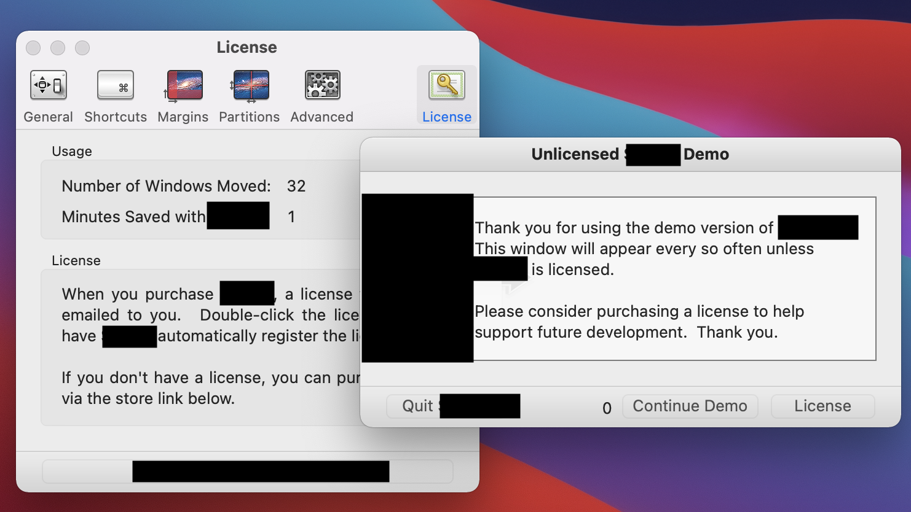
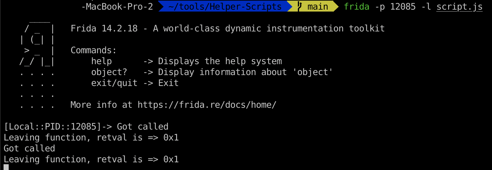
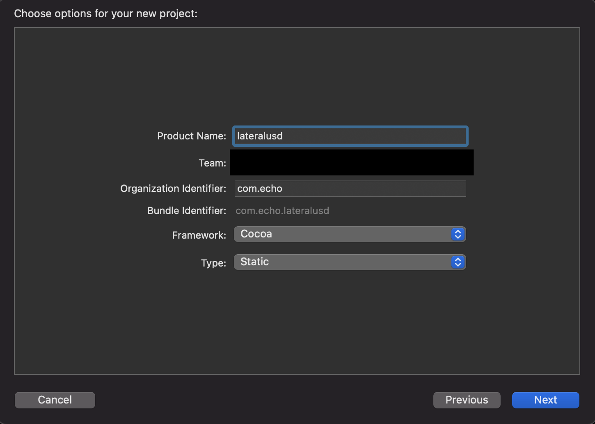
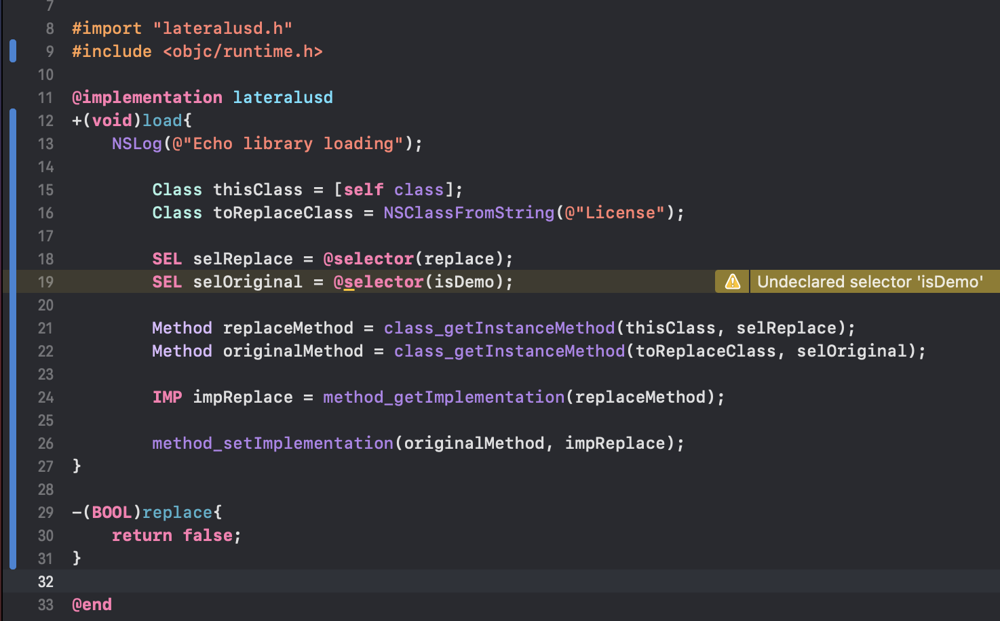
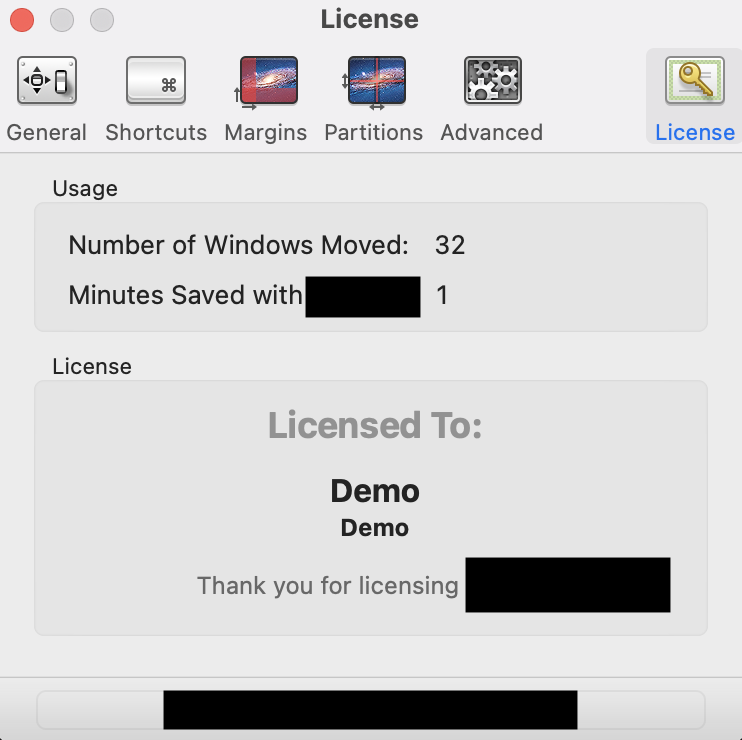

# Introduction

I was thinking about showing you guys how similar iOS and Mac OS applications are. What is the better way than cracking the software on Mac OS. I would not disclose the name of the application and images will be blurred because I do not want to get in trouble lol.

Originally, I was using [Hopper](https://www.hopperapp.com) to patch the binary, but I guess not everyone wants to pay for the things so we will be using `r2`.

The method I will be using is kinda similar to the one talked in the [Code injection on nonjailbroken iPhone](http://localhost:1313/theos_like/) with `.dylib`.

We will also be using `frida` to the analysis and a couple of other programs.

# Analysis

When we open our target application, we are greeted with the following image:



Let's load our binary, on MacOS apps usually located at `/Application/NameOfApp.app/Contents/MacOs/` and see are there any classes with name _License_ or _Demo_. 

```
$ r2 /Application/Target.app/Contents/MacOS/Binary
-- Wow, my cat knows radare2 hotkeys better than me!
[0x1000019b8]> ic ~ License
0x1000306b0 [0x100007c54 - 0x100008b11]   3773 class 0 License :: NSObject
[0x1000019b8]> ic ~ Demo
0x100030a20 [0x10001b089 - 0x10001b440]    951 class 0 DemoDialogController :: NSObject
```

So we got some hits, `License` class appears to be NSObject, while Demo is DemoDialogController. We will focus on License part first.

Let's see the methods available inside of our License class.

```
[0x1000019b8]> ic License
class License
0x100008855 method License      setCustomer:
0x100008825 method License      customer
0x100008874 method License      setEmail:
0x10000883d method License      email
0x100007c54 method License      description
0x10000845d method License      isDemo
0x1000084b5 method License      checkAndStoreLicense:
0x100007fc7 method License      init
0x100008b11 method License c    checkLicense:
0x100007d6f method License c    bestLicenseFile
0x100007de7 method License c    checkStoredLicense
0x100008893 method License c    reportLicenseState:
0x100007e1e method License c    reportStoredLicenseState
0x100007e55 method License c    storedLicenseState
0x100007e9f method License c    setStoredLicenseState:
0x100008274 method License c    verifyLicense:withLicenseServer:
0x100007f0b method License c    existsStoredLicenseBackup
0x100007f39 method License c    existsStoredLicense
0x100007f98 method License c    sharedInstance
```

We got a bunch of them, but the one which caught my intention the most is the `isDemo` method.

Let's use frida to see what is going on here.

I will use my own script to quickly generate the js script to intercept the method.

```
$ git clone https://lateralusd.github.com/Helper-Scripts.git && cd Helper-Scripts/
$ ./skeleton.sh '-[License isDemo]' script.js
```

Let's now attach frida with the script but before that obtain we need to obtain the applications PID.



From the output, we can see that the return value is 0x1 which is true, meaning we are in demo mode. Let's change that.

This is the most likely the method we need to patch.

# Patching
Open up the Xcode and create a new project. Select macOS, click on Library and then go Next. Give it a name and choose `Static` as `Type`.

It should look something like this:



Now, let's write our code to substitute the methods. I am not gonna explain what each line means individually because it is already explained in the post linked at the top.

We need:
* patch `-[License isDemo]` method
* make it return `false`



Basically, we are creating our own method which will replace `-[License isDemo]`. Our method will always return false.

Let's build the library and add it to our binary.

First, lets convert it to dylib.

```bash
$ xcrun clang -shared -all_load -o liblateralusd.dylib liblateralusd.a
$ file liblateralusd.dylib
liblateralusd.dylib: Mach-O 64-bit dynamically linked shared library x86_64
```

Copy it to application directory, I will put it next to the binary.

```bash
$ cp liblateralusd.dylib /Applications/Target.app/Contents/MacOS/
$ insert_dylib --strip-codesig --inplace @executable_path/liblateralusd.dylib /Applications/Target.app/Contents/MacOS/Binary
$ install_name_tool -add_rpath @executable_path/. /Applications/Target.app/Contents/MacOS/Binary
```

If we now run the app we would see the different screen and we patched our application. No more annoying window.



And that is it, we have successfully cracked our application. If you have any questions, do not hesitate to contact me.
