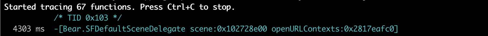
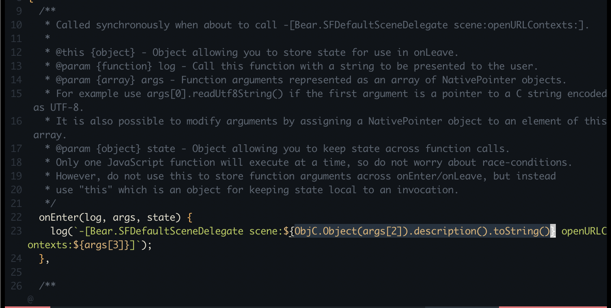
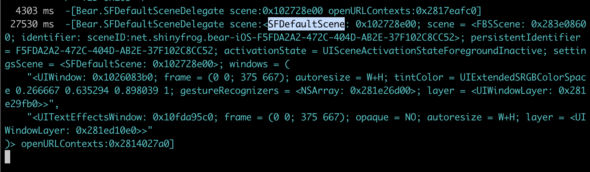
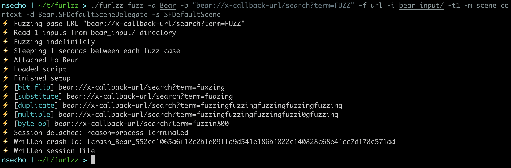
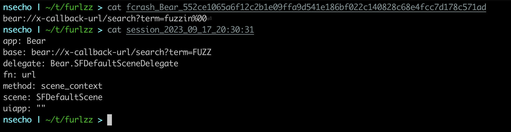
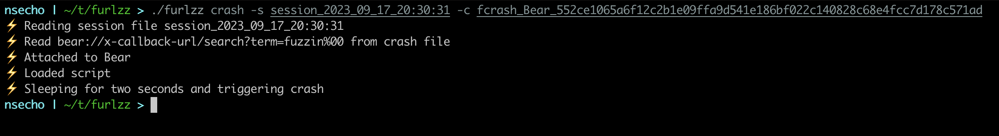
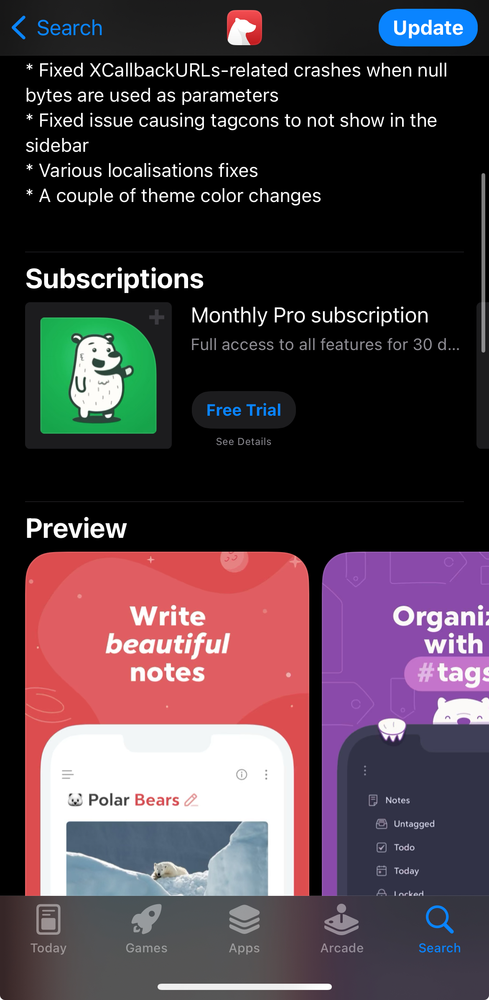

# Introduction

Today we will cover the tool I have created, [furlzz](https://github.com/nsecho/furlzz) which is an iOS URL scheme fuzzer. 
We will go over how to set up and actually start fuzzing. This will be done on the Bear app 2.0.10 which had a simple bug 
which caused the application to crash.

## Tracing URLs using frida-trace

The first step is we need to determine how the application actually opens the URLs, we can do that 
with `frida-trace`. We need some legitimate URL which will be opened inside the application and once we load 
that URL we will take a look at frida-trace output to determine which method is used.

Run `frida-trace -U Bear -m "*[* *openURL*]"`.



We can see that the URLs are opened using `scene:openURLContexts` and based on the `furlzz`, that is the 
method of `scene_context` (`-m` flag). We can also see that the name of the delegate is `Bear.SFDefaultSceneDelegate` (`-d` flag).

We need to determine one more thing before we can start fuzzing, that is the name of the _scene_ class. We can do that 
by editing handler file that the Frida has created for that specific method.

Type the following to edit the file.

```bash
$ vim __handlers__/Bear.SFDefaultSceneDelegate/scene_openURLContexts_.js`
```

Once the file is opened, we will convert `args[2]` to `ObjC.Object` followed by printing its `description()` and converting it to string 
by calling `toString()` and that will be enough to see all the information that we need.



If we now open the URL, we would see that the name of class for `scene` is `SFDefaultScene`.



# Fuzzing

Bear supports a couple of URL schemes, we can see whole list of them [here](https://bear.app/faq/x-callback-url-scheme-documentation/). 
The one we will use is `bear://x-callback-url/search?term=nemo&tag=movies`. We will ignore that tag and just focus on `term` parameter.

The only step that is left to create the directory for our inputs and create some of them.

```bash
$ mkdir bear_input
$ echo -n 'furlzz' > bear_input/1
$ echo -n 'fuzzing' > bear_input/2
```

To recap, we need to pass the following to `furlzz`:

* application => `Bear`
* base URL => `bear://x-callback-url/search?term=FUZZ`
* delegate => `Bear.SFDefaultSceneDelegate`
* scene => `SFDefaultScene`
* method => `scene_context`
* function to post-process => `url`
* input dir => `bear_input`

The full command is `./furlzz fuzz -a Bear -b "bear://x-callback-url/search?term=FUZZ" -f url -i bear_input/ -t1 -m scene_context -d Bear.SFDefaultSceneDelegate -s SFDefaultScene`



We can now examine the URL that caused the crash, additionally when the crash occurs session file is written 
so you can easily replay the crash.



To replay the crash, we just call `furlzz crash` with the session and crash file.



This bug got fixed in version 2.0.11.


