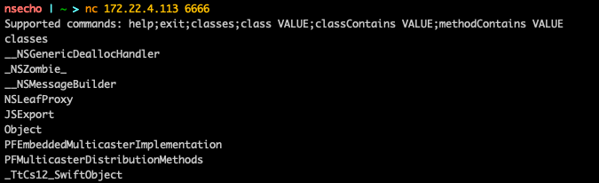
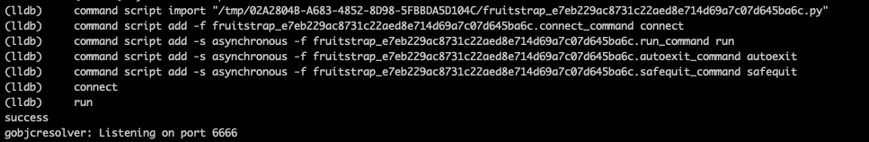
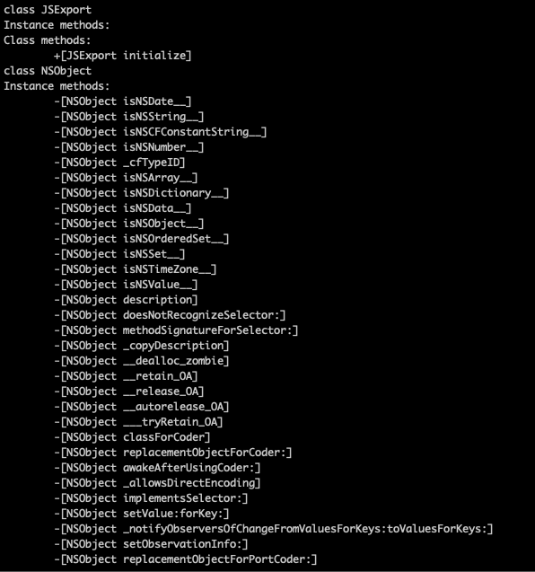

# Introduction

While I was reading and analyzing some of frida code, I explored the idea of objc resolver that is available inside of it.

The idea of resolver is simple:

* load objc dynamic library 
* enumerate classes
* for each class enumerate instance and class methods
* add something more on top of it (like matching based on wildcard)

Our `gobjcresolver.dylib` will look something like:

* enumerate classes
* populate their instance and class methods
* open some port to allow connection
* add custom protocol interaction between server(`gobjcresolver.dylib`) and client(ourselves).

This will be implemented using Go mixed with C code and built as dynamic library ready to be loaded inside the iOS applications.

## Creating Resolver

Interaction with ObjC is available to us using `objc/runtime.h` header file. 
Dynamic library that actually exposes ObjC runtime to us 
is `/usr/lib/libobjc.A.dylib`.

During application/program runtime, we can load specific library using `dlopen` function inside of `dlfcn.h` header file. Once we have obtained the handle
 we can then use `dlsym` function to get function pointers for the symbol.

In `C` code this looks like this:

```C
/*
    If we want to get a handle of lets say function:
    void some_function(char * something) we can use the 
    code that looks like the one below.
*/
// get handle of the library
void * handle = dlopen("/library/path", FLAGS); 
// get function pointer of the symbol
void (*function)(*char) = dlsym(handle, "some_function");
// call function
function("some argument");
```

Now, since we have the way to get function pointers, the functions that we need to get are:

* `objc_getClassList` - to get a list of registered ObjC classes
* `class_getName` - to get a name of the class
* `class_copyMethodList` - to get a list of instance methods for specific class
* `object_getClass` - to get a class methods for specific class
* `method_getName` - to get a name of the method
* `sel_getName` - to convert `SEL` to `char*`

This whole C code will look like this:

```C
#include <dlfcn.h>
#include <objc/runtime.h>
#include <stdio.h>

static int (*getClassList)(void*,int) = NULL;
static char* (*getClassName)(Class) = NULL;
static Method* (*copyMethodList)(Class,int*) = NULL;
static SEL (*getSelector)(Method) = NULL;
static char* (*getSelName)(SEL) = NULL;
static Class (*objectGetClass)(void*) = NULL;

static void * open_handle(void)
{
	void * handle = dlopen("/usr/lib/libobjc.A.dylib",
		RTLD_LAZY | RTLD_GLOBAL | RTLD_NOLOAD);
	getClassList = dlsym(handle, "objc_getClassList");
	getClassName = dlsym(handle, "class_getName");
	copyMethodList = dlsym(handle, "class_copyMethodList");
	getSelector = dlsym(handle, "method_getName");
	getSelName = dlsym(handle, "sel_getName");
	objectGetClass = dlsym(handle, "object_getClass");

	return handle;
}

int do_getClassList(Class * ptr, int count)
{
	return getClassList(ptr, count);
}

char * do_getClassName(Class klass)
{
	return getClassName(klass);
}

Method * do_copyMethodList(Class klass, int * count)
{
	Method * methods = (Method*)malloc(sizeof(Method)*(*count));
	methods = copyMethodList(klass, count);
	return methods;
}

char * do_getSelName(Method method) {
	return getSelName(getSelector(method));
}

Class do_objectGetClass(void * klass)
{
	return objectGetClass(klass);
}

static Class * alloc_classes(int count)
{
	Class * classes = (Class*)malloc(sizeof(Class)*count);
	return classes;
}
```

Due to the limitations of CGO, we cannot directly call function pointers and that is the reason we are having wrapper functions that
actually call our C function pointers.

Our C code is finished, now we will create Go structs that represents `Class`, `Method` and a `Resolver` which will be our entrypoint.

```go
type Method struct {
	handle   C.Method
	selector string
}

type Class struct {
	name            string
	handle          C.Class
	instanceMethods []Method
	classMethods    []Method
}

type Resolver struct {
	classCount int
	handle     unsafe.Pointer
	classes    []Class
}
```

We will create `newResolver()` function which will call `open_handle()` and return `*Resolver`.

```go
func newResolver() *Resolver {
	res := &Resolver{}
	res.handle = C.open_handle()
	return res
}
```

The main Resolver method, `enumerateClasses()` will do the following:

* get count of all classes
* allocate `array` of `Class` with `count` elements
* populate this array using `do_getClassList(array, count)`
* create Go slice that will hold previous array
* for each class in the slice
    * get name using `do_getClassName(class)`
    * get instance methods using `do_copyMethodList(class, &count)` and get each name
    * append these methods to the `instanceMethods` slice for each `Class`
    * get class methods using `do_copyMethodList(do_objectGetClass(class), &count)` and get each name
    * append these methods to the `classMethods` slice for each `Class`
    * append this `Class` to the `classes` slice inside the Resolver

The full code for this method is:

```go
func (r *Resolver) enumerateClasses() {
	r.classCount = int(C.do_getClassList(nil, 0))

	classes := C.alloc_classes(C.int(r.classCount))
	C.do_getClassList(classes, C.int(r.classCount))

	var cls []C.Class

	hdr := (*reflect.SliceHeader)(unsafe.Pointer(&cls))
	hdr.Cap = r.classCount
	hdr.Len = r.classCount
	hdr.Data = uintptr(unsafe.Pointer(classes))

	for _, class := range cls {
		name := C.GoString(C.do_getClassName(class))
		klass := Class{
			name:   name,
			handle: class,
		}
		var count C.int
		instanceMethods := C.do_copyMethodList(class, &count)

		var methods []C.Method

		methodsHdr := (*reflect.SliceHeader)(unsafe.Pointer(&methods))
		methodsHdr.Cap = int(count)
		methodsHdr.Len = int(count)
		methodsHdr.Data = uintptr(unsafe.Pointer(instanceMethods))

		for _, method := range methods {
			klass.instanceMethods = append(klass.instanceMethods, Method{
				handle:   method,
				selector: C.GoString(C.do_getSelName(method)),
			})
		}

		classMethods := C.do_copyMethodList(C.do_objectGetClass(unsafe.Pointer(class)), &count)

		var clsMethods []C.Method

		cMethodsHdr := (*reflect.SliceHeader)(unsafe.Pointer(&clsMethods))
		cMethodsHdr.Cap = int(count)
		cMethodsHdr.Len = int(count)
		cMethodsHdr.Data = uintptr(unsafe.Pointer(classMethods))

		for _, method := range clsMethods {
			klass.classMethods = append(klass.classMethods, Method{
				handle:   method,
				selector: C.GoString(C.do_getSelName(method)),
			})
		}

		r.classes = append(r.classes, klass)
	}
}
```

# Creating TCP server

The next step is creating the code that will setup TCP listener, that waits for the connection and once the connection has been established, 
it allows the usage of Resolver.

```go
//export run
func run() {
	res := newResolver()
	res.enumerateClasses()

	listen, err := net.Listen("tcp", ":6666")
	if err != nil {
		return
	}

	fmt.Println("gobjcresolver: Listening on port 6666")

	go func() {
		conn, err := listen.Accept()
		if err != nil {
			return
		}
		fmt.Printf("gobjcresolver: Connection from %s\n", conn.RemoteAddr().String())
		go handle(conn, res)
	}()
}
```

`//export run` means that we will expose this function to the C code, the reason we are doing this is because inside of our `constructor` we will call this method.

To access the exported Go function, we use `extern` C keyword followed by the function definition.

```C

extern void run(void);

__attribute__((constructor))
static void ctor(void)
{
	run();
}
```

The rest of the code are just some methods that enumerate classes and methods, full code can be viewed at [gobjcresolver](https://github.com/nsecho/gobjcresolver).

# Building and using

```Makefile
CGO_ENABLED = 1
GOOS = ios
GOARCH = arm64
OUTPUT = gobjcresolv.dylib
CC = $(shell xcrun --sdk iphoneos --find clang) \
-arch arm64 \
-isysroot $(shell xcrun --sdk iphoneos --show-sdk-path)
all:
	@CGO_ENABLED=$(CGO_ENABLED) GOOS=$(GOOS) \
		GOARCH=$(GOARCH) CC="$(CC)" \
		go build -buildmode=c-archive -o gobjcresolv.a .
	@xcrun --sdk iphoneos clang -arch arm64 \
		-shared -all_load -o $(OUTPUT) gobjcresolv.a \
		-framework CoreFoundation
	@rm gobjcresolv.h gobjcresolv.a
	@echo "[*] Created dylib $(OUTPUT)" 
```

Once `gobjcresolv.dylib` is created, we can add it to the application using the method described in 
[FridaGadget.dylib on nonjailbroken iPhone](frida_patching.html).




