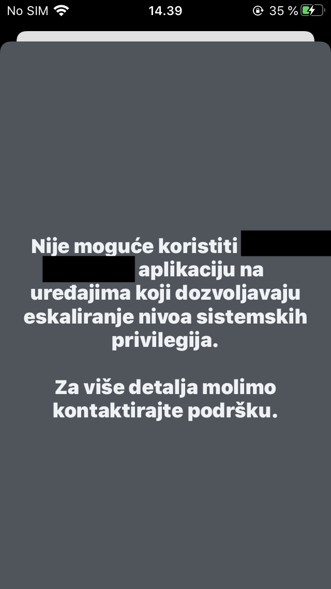

## Introduction
There are thousands of posts just like this one which describes how you should approach bypassing jailbreak detection. This one isn't different, just more step-by-step guide. We will be using _frida_ and _class-dump_ to bypass jailbreak detection. At the end of the post, there will be short snippet how to use theos instead of frida. You should have dumped .ipa file of the application and also you need to unzip .ipa file.

## Information Gathering
After running the application, we are being presented with a sheet view that shows us a message that we can't use the application on jailbroken device. In order to bypass this, we first need to check whether there are some methods which are doing this check. 

After opening the app we are greeted with a view like the one below which translates to "_It is not possible to use CLIENT NAME application on the devices that allows escalation of privileges to system level. For more details, please contant support._"



First, let's dump the classes to see if we will find anything interesting using _class-dump_ tool.

__NOTE:__
_Substitute word Example.app with the app you have_.

```
$ ~/Downloads/class-dump -S -s -H Payload/Example.app/Example -o /tmp/example_headers
```

Let's examine these headers.
```
$ cd /tmp/example_headers
$ ls -l | grep -iP root|jailbreak
[ ... REDACTED ... ]
-rw-r--r--  1 daemon1  wheel    545 Jan 26 09:26 RootCheckResult.h
-rw-r--r--  1 daemon1  wheel    910 Jan 26 09:26 RootManagerModule.h
```

We have found two interesting header files in there, _RootCheckResult.h_ and _RootManagerModule.h_. Lets examine both and see what we will found in there.

```
$ cat RootCheckResult.h
//
//     Generated by class-dump 3.5 (64 bit) (Debug version compiled Sep 17 2017 16:24:48).
//
//     class-dump is Copyright (C) 1997-1998, 2000-2001, 2004-2015 by Steve Nygard.
//

#import <objc/NSObject.h>

@class NSString;

@interface RootCheckResult : NSObject
{
    _Bool _isRooted;
    NSString *_rootCheckFailed;
}

- (void).cxx_destruct;
- (id)init;
@property(nonatomic) _Bool isRooted; // @synthesize isRooted=_isRooted;
@property(retain, nonatomic) NSString *rootCheckFailed; // @synthesize rootCheckFailed=_rootCheckFailed;

@end
```

And _RootManagerModule.h_:
```
$ cat RootManagerModule.h
//
//     Generated by class-dump 3.5 (64 bit) (Debug version compiled Sep 17 2017 16:24:48).
//
//     class-dump is Copyright (C) 1997-1998, 2000-2001, 2004-2015 by Steve Nygard.
//

#import <objc/NSObject.h>

#import "RCTBridgeModule-Protocol.h"

@class NSString, RCTBridge;
@protocol OS_dispatch_queue;

@interface RootManagerModule : NSObject <RCTBridgeModule>
{
}

+ (void)load;
+ (id)moduleName;
- (_Bool)canViolateSandbox;
- (_Bool)checkPaths;
- (_Bool)checkSchemes;
- (id)constantsToExport;
- (id)isJailBroken;
- (id)pathsToCheck;
- (id)schemesToCheck;

// Remaining properties
@property(readonly, nonatomic) __weak RCTBridge *bridge;
@property(readonly, copy) NSString *debugDescription;
@property(readonly, copy) NSString *description;
@property(readonly) unsigned long long hash;
@property(readonly, nonatomic) NSObject<OS_dispatch_queue> *methodQueue;
@property(readonly) Class superclass;

@end

```

We can see that we have property called _isRooted_ inside RootCheckResult.h header file.

Let's write a short frida script to see when this property get's called. I will be using my own [skeleton.sh](https://github.com/lateralusd/Helper-Scripts/blob/main/skeleton.sh) script to generate script for frida.

```
$ ./skeleton.sh '-[RootCheckResult isRooted]' script.js
```

Let's see the content of it.
```
$ cat script.js
var impl = ObjC.classes.RootCheckResult["- isRooted"];

Interceptor.attach(impl.implementation, {
	onEnter: function(args) {
		console.log("Got called");
	},
	onLeave: function(retval) {
		console.log("Leaving function, retval is => " + retval);
	}
});
```

Let's now run our application with frida using early instrumentation.

```
$ frida -U -f com.echo.example -l script.js --no-pause
     ____
    / _  |   Frida 14.0.8 - A world-class dynamic instrumentation toolkit
   | (_| |
    > _  |   Commands:
   /_/ |_|       help      -> Displays the help system
   . . . .       object?   -> Display information about 'object'
   . . . .       exit/quit -> Exit
   . . . .
   . . . .   More info at https://www.frida.re/docs/home/
Spawned `com.echo.example`. Resuming main thread!
[iPhone::com.echo.example]-> Got called
Leaving function, retval is => 0x1

```

## Bypassing

So we can see that our method get's called and that is returning 0x1 as an indication that the device is jailbroken. If we overwrite the return value, we may be able to bypass the check. Our updated _script.js_ file looks like this:

```
$ cat script.js
var impl = ObjC.classes.RootCheckResult["- isRooted"];

Interceptor.attach(impl.implementation, {
	onEnter: function(args) {
		console.log("Got called");
	},
	onLeave: function(retval) {
		var newRetval = ptr("0x0"); // Create a new variable with value 0x0
		retval.replace(newRetval);  // Replace old return value with the new one we have created
		console.log("Leaving function, retval is => " + retval);
	}
});
```

Let's now run it and hope for the best.
```
$ frida -U -f com.echo.example -l script.js --no-pause 
     ____
    / _  |   Frida 14.0.8 - A world-class dynamic instrumentation toolkit
   | (_| |
    > _  |   Commands:
   /_/ |_|       help      -> Displays the help system
   . . . .       object?   -> Display information about 'object'
   . . . .       exit/quit -> Exit
   . . . .
   . . . .   More info at https://www.frida.re/docs/home/
Spawned `com.echo.example`. Resuming main thread!
[iPhone::com.echo.example]-> Got called
Leaving function, retval is => 0x0
```

We can see that we have indeed overwritten the return value and if we take a look on the application, we can see that we have bypassed it.


## Theos instead of frida
Fire up your _nic.pl_, select _iphone/tweak_ and choose correct bundle for your application. In order to bypass this check using Theos, my Tweak.xmfile will look like this:

```
$ cat Tweak.x

%hook RootCheckResult

-(_Bool) isRooted {
	return false;
}

%end
```
