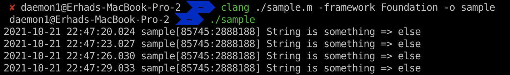
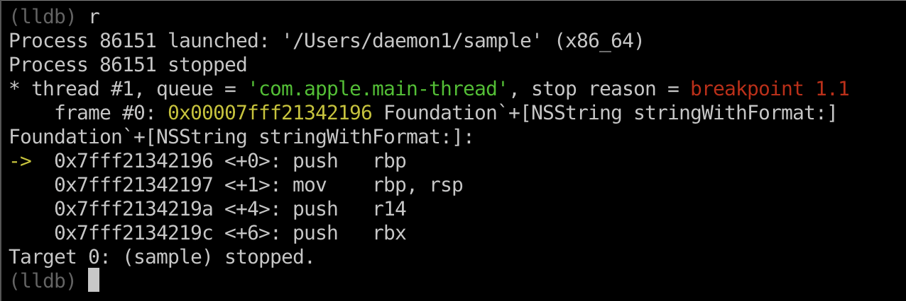
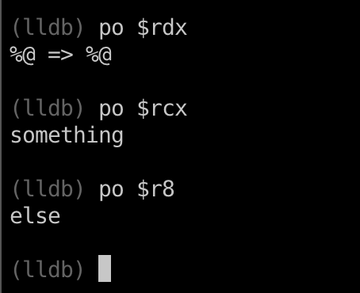
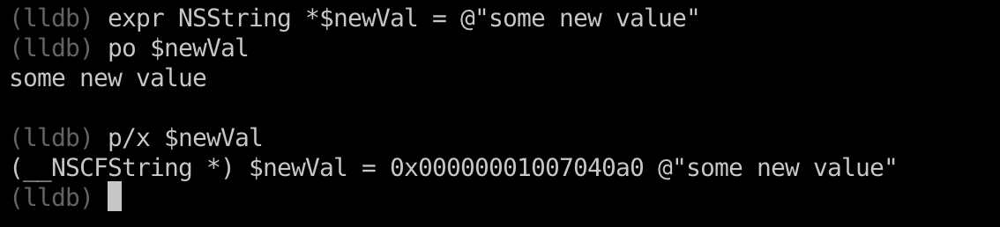
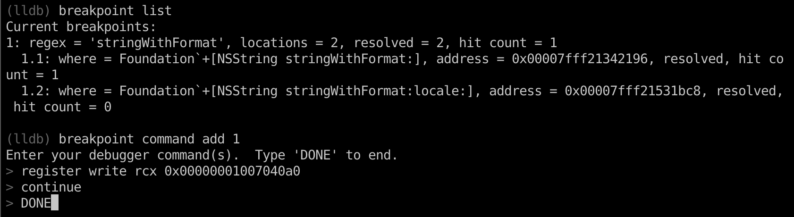
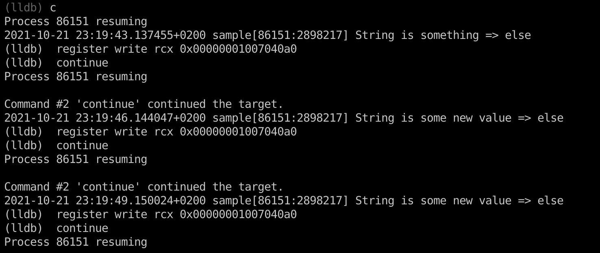
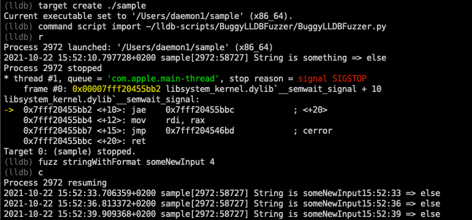

## Introduction

Today I will try to walk you through some of the lldb functionalities which could be helpful to fuzz the target binary and we will end it with the small script which could be further extended. The script is on my github, so feel free to make PR request with the changes you think are needed.

Anyway, let's start it by first showing you our target binary.

## Breakpoints and parameter modification

```c
#include <unistd.h>
#import <Foundation/Foundation.h>

int main(void) {
	for (;;) {
		NSString * aa = [NSString stringWithFormat:@"%@ => %@", @"something", @"else"];
		NSLog(@"String is %@", aa);
		sleep(3);
	}
	return 0;
}
```

When we run the binary it will forever print __String is something  => else__ like we can see below.



My goal is to change the parameter "something" to some other word.

Let's load the binary inside the lldb and make a breakpoint on the wanted function, in our case `+[NSString stringWithFormat:]`.

```bash
(lldb) target create ./sample
Current executable set to '/Users/daemon1/sample' (x86_64).
(lldb) rbreak stringWithFormat
Breakpoint 1: 2 locations.
(lldb) breakpoint list
Current breakpoints:
1: regex = 'stringWithFormat', locations = 2
  1.1: where = Foundation`+[NSString stringWithFormat:], address = Foundation[0x00007fff21150196], unresolved, hit count = 0
  1.2: where = Foundation`+[NSString stringWithFormat:locale:], address = Foundation[0x00007fff2133fbc8], unresolved, hit count = 0
```

I am using `rbreak` which sets up the breakpoint on the specified regex.

If we run our binary now, we will see soon that we hit our breakpoint.



On the x86_64 architecture, parameters are passed as following:
* First argument - rdi
* Second argument - rsi
* Third argument - rdx
* Forth argument - rcx
* Fifth argument - r8
* Sixth argument - r9
* More than six arguments - on the stack

If we were now to inspect our registers, we would see something odd, let's see what it is. We can use `po $rdi` which will call method `description` on the address that is inside the rdi register.

```bash
(lldb) po $rdi
NSString
```

If you were expecting `@"%@ => %@"` inside the rdi register, you are wrong. The reason why you are wrong is that the messages in Objective c are all passed using `objc_msgSend` function which accepts the parameters:
1. The class
2. The selector of the method
3. Variadic - Selector parameters

Once we get that out of the way, the next logical thing to expect is that we will see `stringWithFormat:` inside the rsi register.

```bash
(lldb) po $rsi
140735269523590
```

And we don't, we can see some garbage. Maybe if we try to cast it to something else, it would be more meaningful.

```bash
(lldb) po (SEL)$rsi
"stringWithFormat:"
```

And now we can confirm that inside the rsi register is indeed the method that we are calling. So, we can conclude that the content of the registers will be:

* $rdx - @"%@ => %@"
* $rcx - @"something"
* $r8 - @"else"



I said earlier that I want to change the parameter _@"something"_ into some other word. In order to do that, we need to overwrite our current $rcx which now holds the address of @"something".

I will use `breakpoint command` to automate the taks, but let's first create the variable which will hold our new value.



We can see that we have created new NSString which holds _@"some new value"_ inside of it, and we can see that it's address is _0x00000001007040a0_.

This is the address we need to write inside of our $rcx register.

`breakpoint command` gets executed each time the breakpoint is hit and each time the breakpoint is hit, we want to replace it with the address of our new value.



`continue` means continue the execution without stopping when we hit the breakpoint.

If we type `continue` now, we will hopefully see new output.



And congrats, we have successfully changed the value, but if you take a look at this, you can see that it is pretty boring, all the time the same value. That is exactly what we are gonna do next, implement some kind of algorithm to change the value each time.

## Fuzzing with python script

Playing with lldb would be boring if there wasn't python API. I won't go over all the details inside the script, but will cover the main functionalities and how we can extend it to be more general and perhaps to find some new bugs.

The script can be found at [BuggyLLDBFuzzer repo](https://github.com/lateralusd/BuggyLLDBFuzzer). I called it buggy because I am not an expert on this and generally in python so therefore the name.

I will first demonstrate how it works, and then we will walk over the script, so grab the script and load the target binary to lldb. I like to keep all of my script inside the `~/lldb-scripts/` directory.

```bash
$ mkdir ~/lldb-scripts
$ git clone https://github.com/lateralusd/BuggyLLDBFuzzer.git ~/lldb-scripts/BuggyLLDBFuzzer
$ lldb ./sample
```

In order to use any script inside our binary, we first need to import it, we are doing that with `command script import /path/to/the/script.py`. After we have loaded our script, we can use it. Primitive fuzzing with the script can be seen on the screenshot below.

 

You just call the `fuzz` command passing the function/method you want to fuzz, in our case it is `stringWithFormat:`, you also pass initial input and argument number. Remember that the 4th parameter is `@"something"` and that is the one we want to change/fuzz.

### Internals

Let's analyze the script.

```python
import lldb
import shlex
from datetime import datetime
```

The first thing we can see are imports, the main module is __lldb__, __shlex__ is used to split command line arguments, and __datetime__ will be used for our algo.

Further below we can see:

```python
input = None
addr = None
arg_num = None

reg_name = {
    '1': 'rdi',
    '2': 'rsi',
    '3': 'rdx',
    '4': 'rcx',
    '5': 'r8',
    '6': 'r9'
}
```

* _input_ will hold the original input that we will fuzz
* _arg_ will hold the address of our NSMutableString which will hold the fuzzed value which will be sent to the function
* _arg_num_ determines function parameter
* *arg_num* will determine which register we need to use to overwrite the value.

Next we can see:

```python
def __lldb_init_module(debugger, internal_dict):
    debugger.HandleCommand('command script add -f BuggyLLDBFuzzer.fuzz fuzz')
```

These two lines define a function called __lldb_init_module which will get called as soon as we import our script.

The reason we need this is because it is not enough just to import the script and it will magically work, we need to actually tell which function will be available to us by using `command script add -f`. It accepts two parameters:
* ScriptName.function - function we will map to
* what it will be map to

Meaning, as soon as we import our script, `command script add -f BuggyLLDBFuzzer.fuzz fuzz` will be called and we can interact with it using the new `fuzz` command.

Then we come to the real meat of the script:

```python
def fuzz(debugger, command, result, internal_dict):
    global input
    global addr
    global arg_num
    args = shlex.split(command)

    func = args[0]
    input = args[1]
    arg_num = args[2]

    # create the NSMutableString holding our initial input that will get mutated
    command = r'''
        @import Foundation;
        NSMutableString *fuzzd = (NSMutableString*)[[NSMutableString alloc] init];
        [fuzzd setString:@"{}"];

        fuzzd;
    '''.format(input)
    expr = "expression -lobjc -O -- " + command

    res = executeCommand(command)
    addr = res.GetAddress()

    target = debugger.GetSelectedTarget()
    breakpoint = target.BreakpointCreateByRegex(func)
    breakpoint.SetScriptCallbackFunction("BuggyLLDBFuzzer.handle")
```

Function fuzz is responsible for:
* getting input from the user and mapping it to our global variables
* creating the NSMutableString which will hold the fuzzed value that is gonna be sent to the function
* obtaining the address of the newly created NSMutableString and saving it to the global `addr` variable
* setting up a breakpoint

So, if we call it like `fuzz stringWithFormat randomInput 4`, our global variables will be:
* input = "randomInput"
* addr = could not be known before we run it
* arg_num = 4

In order to setup the breakpoint, we first need to obtain the SBTarget type variable from the debugger, by calling `debugger.GetSelectedTarget()`. Then we setup the breakpoint on the function we passed to the `fuzz` command (the first parameter). After that we define the handler by calling `breakpoint.SetScriptCallbackFunction("BuggyLLDBFuzzer.handle"). Each time the breakpoint is hit, our `handle` function will be called.

Our function `handle` looks like:

```python
def handle(frame, bp_loc, dict):
    thread = frame.GetThread()
    process = thread.GetProcess()
    debugger = process.GetTarget().GetDebugger()
    interpreter = debugger.GetCommandInterpreter()

    debugger.SetAsync(False)

    fuzzd = algo()

    # Write new value inside our NSMutableString
    ret = lldb.SBCommandReturnObject()
    expr = 'expression -lobjc -- (NSMutableString*)[' + str(addr) + ' setString:@"' + fuzzd + '"]'
    interpreter.HandleCommand(expr, ret)

    reg = reg_name[arg_num]

    # Fill the argument accordingly
    ret_value = lldb.SBCommandReturnObject()
    expression = 'register write ' + reg + ' ' + str(addr)
    interpreter.HandleCommand(expression, ret_value)

    return False
```

First we obtain couple of objects in order to get the lldb.SBCommandInterpreter which will we use to execute our command.

We then setup the debugger into `sync` mode, meaning dont return to the lldb until we are done. 

We get the new value by calling `algo()` function which you can implement however you want.

Then we put the new string at our NSMutableString created inside the `fuzz()` function and we let the interpreter execute the command.

We obtain the register we need to write it to based on the paremeter number.

The last step is to write the address of NSMutableString into the correct register(reg variable).

The reason why we are using two different ways to execute commands is that in the first case we want to get the lldb.SBValue so we can get it its address and in the latter we just need to execute, no need for some kind of confirmation.

And basically, that is it, small fuzzing skeleton using python lldb API. If you have any question and I am sure you will have, create a github issue so I can update the README or this blog post. If you want to develop this further into some more general fuzzer, feel free to work on it and do PR.

[BuggyLLDBFuzzer repo](https://github.com/lateralusd/BuggyLLDBFuzzer)
