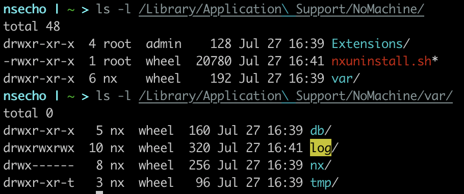
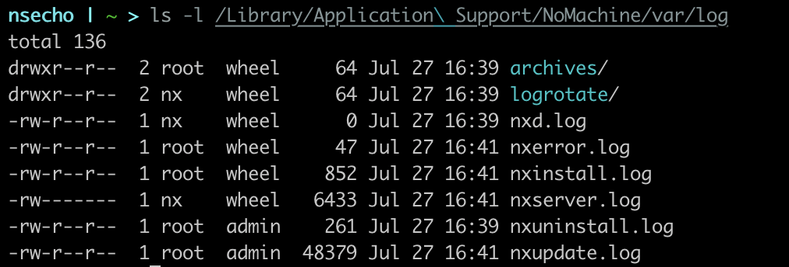
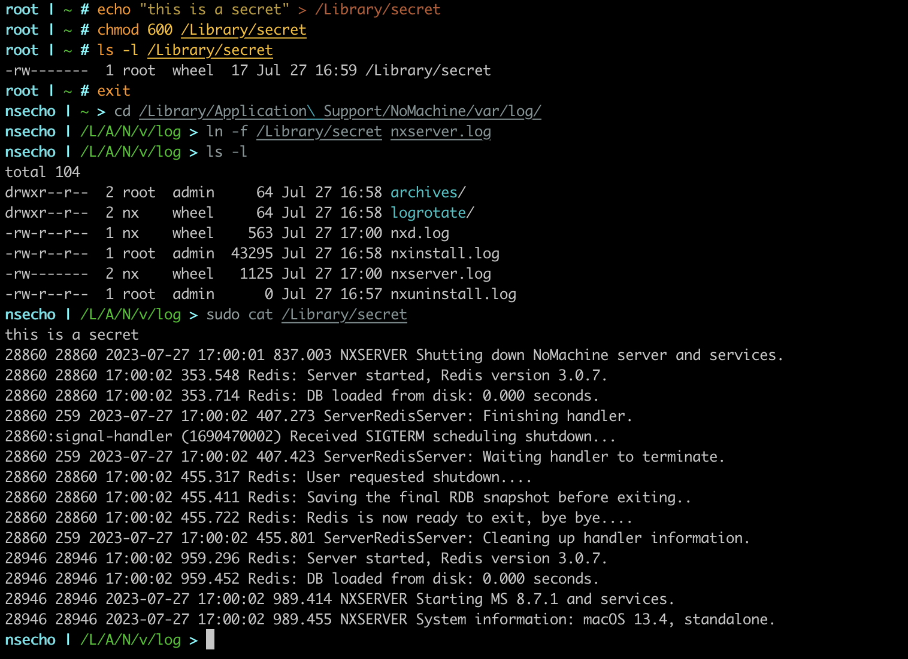

# Introduction

[NoMachine](https://nomachine.com) is a free remote desktop solution which features higher speeds than usual competitors. I have identified the possibility to overwrite root-owned files and after 
I have created PoC, I have contacted NoMachine team which was quick to address the vulnerability and to issue the new update.

The vulnerability was affecting NoMachine free edition and Enterprise Client for macOS and it is fixed in version _v8.8.1_.

# Analysis

`NoMachine` application writes log files to the directory `/Library/Application Support/NoMachine/var/log`. Examining the permissions of this
directory we can see that the directory is owned by the user `nx` and that `rwx` is set for everyone.

The directory contains a couple of `.log` files. Because we are granted `rwx` we can simply create a hardlink which points 
to the root-owned file and once the application writes something to the log file, that root-owned file would get overwritten.

# Exploitation

To exploit the vulnerability, we need to simply create the hardlink. As a `root` user, we will create `/Library/secret` file and 
make `nxserver.log` as a hardlink to that file.

