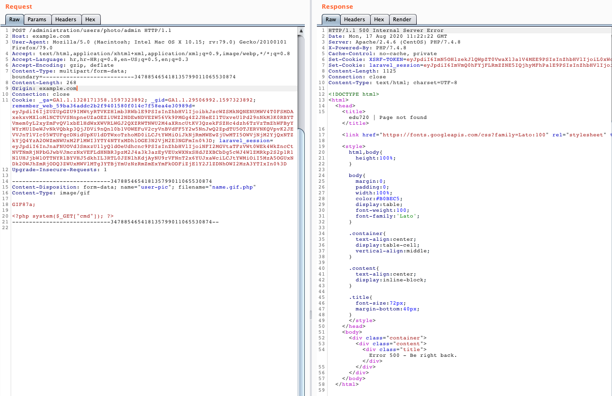
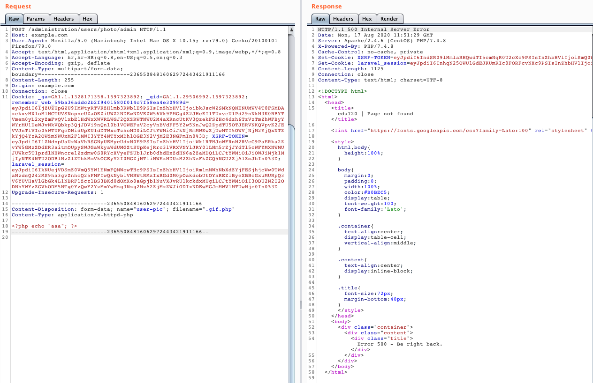
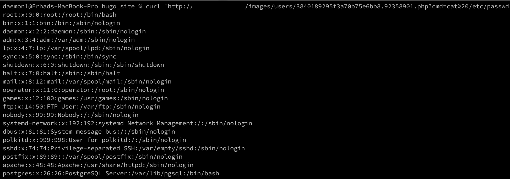

## Introduction

I know this is not about MacOS nor iOS but this was something that had to be written.

Recently I had a web application penetration test on which I have found CSV injection and a great example of bypassing PHP image upload. Users with admin privileges had an option to change user's profile picture which immediately caught my eye.

## App details
* Fictional hostname: example.com
* Language: PHP
* Framework: Laravel

## Analysis

After messing around with trying to upload some php shell I was constantly getting 500 Internal Server Error which was kinda a clue to me that application is not allowing anything besides good ol' images. 

Application is storing images on the server by generating random id and combining it with file extension. It gets stored at **http://example.com/images/users/ID.EXTENSION**.

Example: **http://example.com/images/users/1191723995f3a343b45e2d9.82154619.jpg**

## Attack

I first have tried to upload php file and change its filename to name.gif.php and embeding some PHP code without success. File gets uploaded as php but without execution which can be seen on following image.

After inspecting elements, I saw that file got saved as **864064135f3a686e303ab8.04907479.php**, after checking with browser the location I saw only GIF87a; on the page.

The thing which caught my attention was 500 Internal Server Error even though the file got uploaded.

The next thing i have tried is removing completely _GIF87a;_, changing mime type to __application/x-httpd-php__ and filename just to __.gif.php__. Application stripped .gif and saved php file, inspecting the element and checking the URL I saw that PHP file really got executed. Once again I got 500 Internal Server Error but the file got uploaded so I didn't really care. 

Changing the body to `<?php system($_GET["cmd"]); ?>`, uploading the file, getting the URL I have proceeded to get file __/etc/passwd/__ with success and it is game over.

## Point of the post
Do not get discouraged if you get internal server error, try to mess around and play with everything you see. You never know what the application is doing when you are blackboxing.
