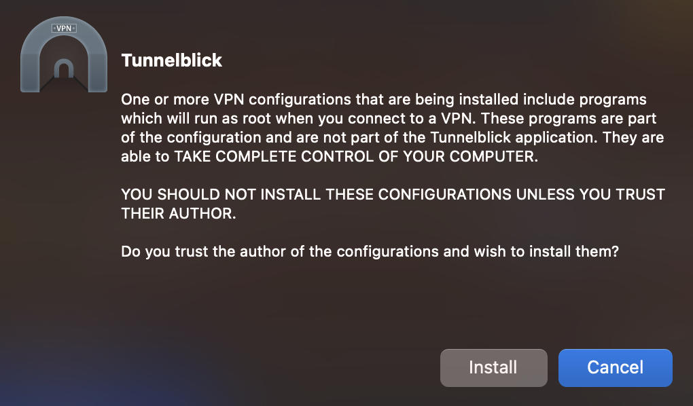
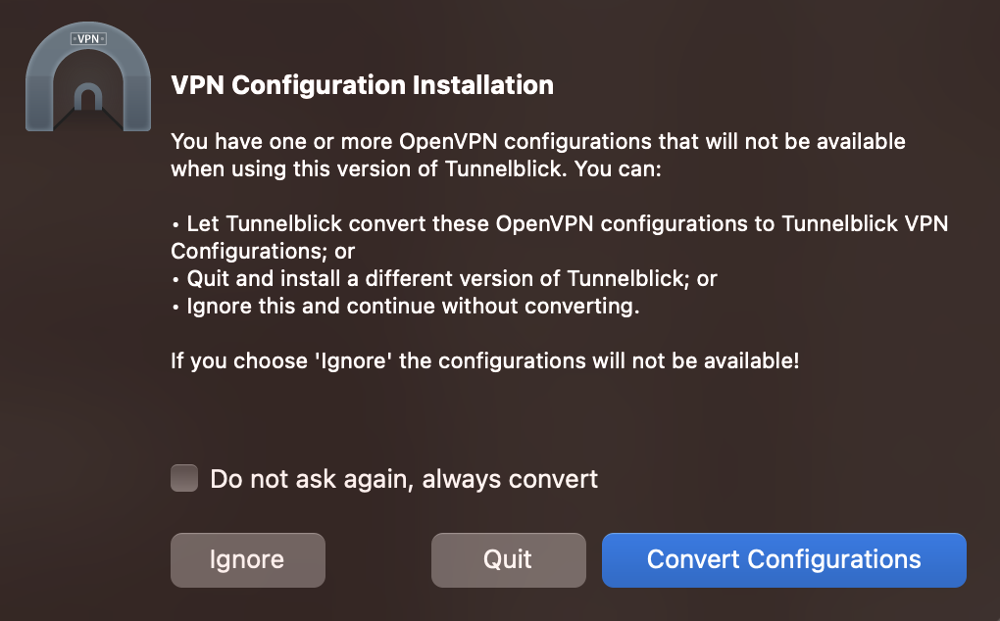
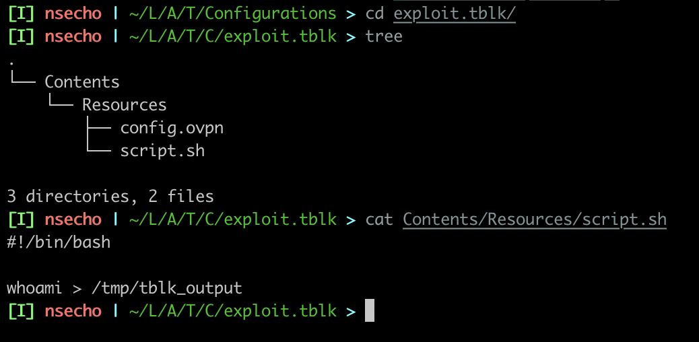
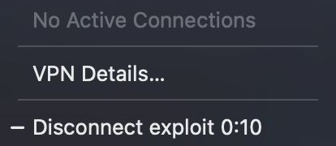
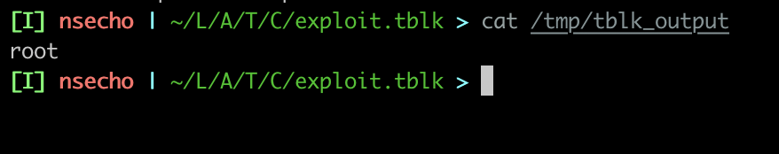

# Introduction

Any time I have to connect to some VPN using `.ovpn` file, I am using [Tunnelblick](#). Tunnelblick 
allows installation of `.ovpn` files using simple drag and drop method and it works great. 

This vulnerability is affecting Tunnelblick versions 3.8.8b and 4.0.0beta01 through 4.0.0beta05.

However, I was wondering whether it is possible to execute some commands as `root` user because working with 
VPN requires root privileges.

After googling, I have found this [link](https://unix.stackexchange.com/questions/398036/running-a-command-after-my-openvpn-client-connects) which 
says that we can indeed call our own scripts or binaries using something like:

```
script-security 2
up /path/to/script.sh
```

If we can import the _malicious_ ovpn file, we could achieve privilege escalation as that script 
would be run as root user.

# Analysis

For the script to execute once the VPN connection is established we will use the following script 
saved at `/tmp/script.sh`.

```bash
#!/bin/bash

whoami > /tmp/tblk_output
```

Lets give the script executable permissions, so that it can be run freely (`chmod +x /tmp/script.sh`).

We also need some ovpn file and once we do have one, just append the following at the end of the file.

```
script-security 2
up /tmp/script.sh
```

Now that we have malicious ovpn file crafted, where and how do we use it. If we try just to load it into the Tunnelblick 
we would be presented with the window warning us that the file contains the code which will be run as root user.



This is too noisy, and we do not want this.

After poking around a bit with Tunnelblick I have noticed that it writes some logs to `/tmp/tunnelblick-installer-log.txt`.

Taking a look at it, we can see that it is working with `~/Library/Application Support/Tunnelblick/Configurations` directory. After copying 
`exploit.ovpn` to this location, nothing happens. However, if restart the Tunnelblick, a new window is shown where 
Tunnelblick is asking whether we would like to convert configuration (from `.ovpn` to `.tblk`). 



If we take a look at that _Configurations_ directory, we can see that new `exploit.tblk` directory is created. Inspecting that directory 
shows our `script.sh` inside of it, containing the original content of `/tmp/script.sh`.



If we now connect to this new VPN, our script will execute, and we can confirm that by checking output of `/tmp/tblk_output`.





And there you have it, we are `root` user. Although, the user will be presented with the window to authenticate in order
to convert the file, they usually are unaware what they are doing and will blindly enter their password without realizing that they are 
giving root permissions to some third-party.
