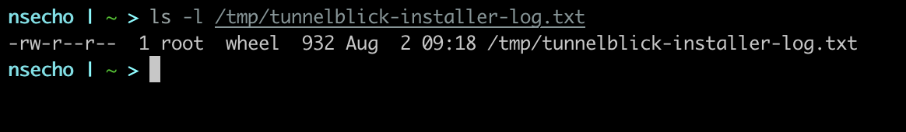
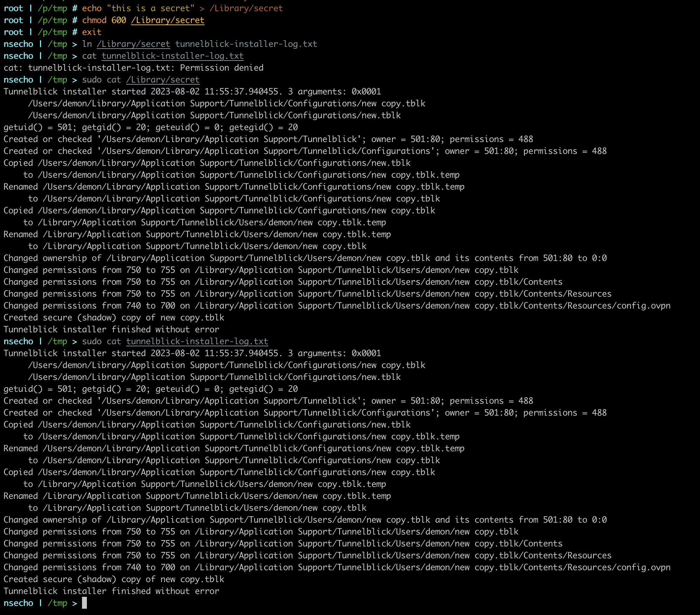

# Introduction

Following the [Assisted LPE](./tunnelblick_assisted_lpe.html) vulnerability in [Tunnelblick](https://tunnelblick.net), I have decided to dig some more and discovered Arbitrary File Overwrite which allows non-root user to overwrite root-owned files. This vulnerability is the same as [NoMachine Arbitrary File Overwrite](./nomachine_afo.html).

# Analysis

Tunnelblick writes logs to location `/tmp/tunnelblick-installer-log.txt` and this file is owned by root. If we can manage to to create file `/tmp/tunnelblick-installer-log.txt` which points to some root-wowned file, we can overwrite that file because the process that writes to this file is run as `root`.

To confirm that the file is indeed owned by root, we will issue `ls -l` command on the file.

# Exploit

For the demonstration purposes, let's say that we know that the Tunnelblick is installed, but not started (file `/tmp/tunnelblick-installer-log.txt` is not present).

To exploit it, we will create a file /Library/secret as a root user and we will give read/write permissions to that file to the root user.

After that, we will create hardlink named `/tmp/tunnelblick-installer-log.txt` that points to that `/Library/secret` file and once the write to the log file has been triggered, file that is pointed to by the hardlink(`/Library/secret`) will be overwritten.

We can see that the contents of the `/Library/secret` and `/tmp/tunnelblick-installer-log.txt` are the same.

